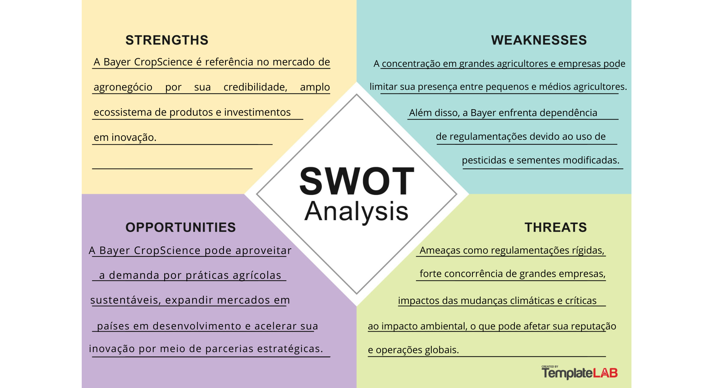
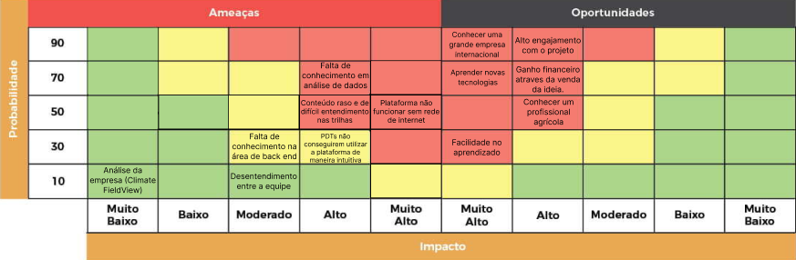
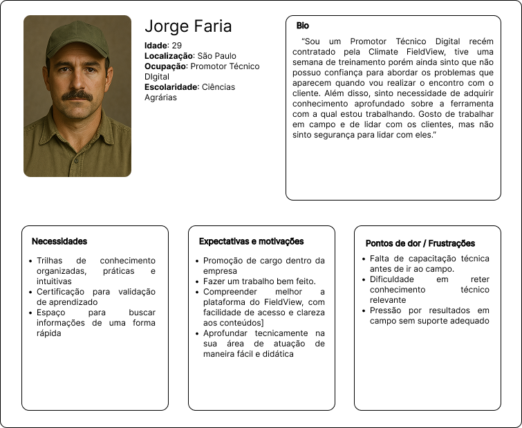
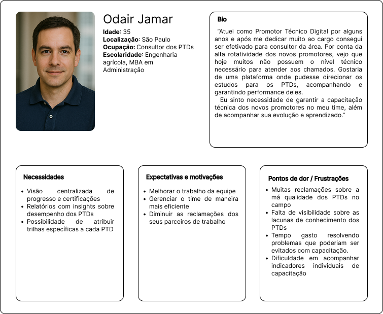

# WAD - Web Application Document - Módulo 2 - Inteli

**_Os trechos em itálico servem apenas como guia para o preenchimento da seção. Por esse motivo, não devem fazer parte da documentação final_**

## Nome do Grupo

#### Nomes dos integrantes do grupo

## Sumário

[1. Introdução](#c1)

[2. Visão Geral da Aplicação Web](#c2)

[3. Projeto Técnico da Aplicação Web](#c3)

[4. Desenvolvimento da Aplicação Web](#c4)

[5. Testes da Aplicação Web](#c5)

[6. Estudo de Mercado e Plano de Marketing](#c6)

[7. Conclusões e trabalhos futuros](#c7)

[8. Referências](c#8)

[Anexos](#c9)

 

# 1. Introdução (sprints 1 a 5)

&emsp; O Climate FieldView faz parte do portfólio de soluções digitais da Bayer Crop Science, que visa ajudar os agricultores a tomarem decisões mais informadas e precisas em suas operações agrícolas. A plataforma oferece uma variedade de ferramentas e recursos para monitorar e gerenciar as atividades agrícolas, desde o planejamento até a colheita. A problemática trazida pelo parceiro se dá à medida que os agentes responsáveis para a instalação e suporte presencial do produto nas fazendas (os chamados Promotores Técnicos Digitais) muitas vezes não possuem a capacitação técnica necessária para realizar tais atendimentos. 

&emsp; A solução desenvolvida busca ser uma ferramenta para auxiliar na formação e capacitação desses profissionais, permitindo que eles tenham acesso a informações técnicas e práticas sobre o uso do Climate FieldView de maneira fácil e rápida. A plataforma oferece diferentes trilhas do conhecimento sobre as diferentes funcionalidades do sistema além de um sistema de pesquisa que permite que o usuário encontre rapidamente o conteúdo desejado. 

&emsp; Além disso, a plataforma conta com um sistema de gamificação e pontos que visa incentivar o aprendizado e a aplicação prática dos conhecimentos adquiridos, possibilitando tanto que os promotores técnicos se capacitem para realizar atendimentos mais qualificados, quanto que a liderança tenha um controle sobre o nível de conhecimento dos seus promotores.

# 2. Visão Geral da Aplicação Web (sprint 1)

&emsp; Na seção a seguir será apresentada a visão geral do projeto, englobando o escopo do projeto, persona e user stories para levantar informações acerca dos negócios e UX da solução.

## 2.1. Escopo do Projeto (sprints 1 e 4)
&emsp; No que diz respeito ao escopo do projeto, realizou-se uma análise aprofundada da empresa e da aplicação web, resultando: modelo de 5 forças de Porter, análise SWOT, solução, value proposition canvas e matriz de riscos.

### 2.1.1. Modelo de 5 Forças de Porter (sprint 1)

&emsp; O modelo de 5 forças de Porter é uma ferramenta de análise para avaliar a competitividade no setor de negócios que a empresa atua [7]. Sob o ponto de vista da Bayer Crop Science, montou-se o seguinte modelo:

Figura 1: 5 Forças de Porter aplicadas à empresa Bayer Crop Science.  
      
Fonte: Material produzido pelos autores (2025).

#### **Rivalidade entre concorrentes**

&emsp; Em relação à concorrência no mercado agrícola, os rivais da Bayer Crop Science podem ser divididos entre o ramo de sementes, proteção de cultivos e soluções digitais.

&emsp; No que diz respeito à área de sementes, a rivalidade entre os concorrentes é alta, uma vez que há grandes companhias atuando nesse ramo. A exemplo disso, pode-se citar empresas como: DowDuPont Inc., Syngenta AG, Groupe Limagrain e KWS SAAT SE [9].

&emsp; No que se refere ao mercado de proteção de cultivos, a rivalidade entre concorrentes também é alta, já que existem diversas empresas grandes disputando nessa área. Dentre as principais empresas, cita-se: Syngenta Crop Protection, BASF, Corteva, entre outras [2].

&emsp; Com relação ao ramo de soluções digitais na agricultura, a rivalidade entre concorrentes é alta, visto que é um mercado dominado por big techs. Exemplificando, essa área é dominada pelas empresas AGCO Corporation, Deere & Company, IBM Corporation e Microsoft [8].

#### **Poder de barganha dos compradores**

&emsp; O poder de barganha dos clientes é baixo, visto que os produtos oferecidos pela Bayer Crop Science oferecem funcionalidades e tecnologias exclusivas que reduzem a sensibilidade dos clientes ao preço. Exemplificando, há o programa de fidelidade Impulso Bayer, na qual é possível trocar pontos por recompensas [5], e o produto FieldView apresenta ferramentas tecnológicas únicas para o produtor rural [4]. Assim, os fatores técnicos e as exclusividades que a empresa oferece são decisivos para motivar a compra dos consumidores.

#### **Poder de barganha dos fornecedores**

&emsp; O poder de barganha dos fornecedores é alto, devido à necessidade que a empresa possui por serviços especializados de outras companhias. Acerca disso, no ramo de sementes, como exemplo há o Agroeste e Dekalb; na proteção de cultivos, existem a Curbix, Sivanto e outros; além disso, nas soluções digitais, pode-se citar o The Climate Corporation com a plataforma agrícola Climate FieldView [3].

#### **Ameaça de produtos substitutos**

&emsp; A ameaça de produtos substitutos é média, levando em conta o perfil diversificado dos produtores rurais. Embora uma grande quantidade de produtores rurais optem por serviços já usados cotidianamente, percebe-se que atualmente há uma crescente adoção de soluções digitais e novas tecnologias nos campos agrícolas. Dessa forma, percebe-se a mudança de perfil dos consumidores, aceitando o emprego de novos produtos em suas propriedades [1].

#### **Ameaça de novos entrantes**
&emsp; A ameaça de novos entrantes é baixa, tendo em vista que o mercado agrícola já é bem consolidado com empresas de grande relevância internacional. Sob esse contexto, o ramo agrícola é de alta competitividade no nível mundial, na qual empresas como a própria Bayer Crop Science, Corteva, Phos Agro, AGCO, Sime Darby Plantation e outras companhias disputam um lugar de destaque. Por conseguinte, apesar do crescimento constante, o mercado agrícola é de difícil acesso para novos entrantes em todas as áreas de atuação do agronegócio [6].

### 2.1.2. Análise SWOT da Instituição Parceira (sprint 1)

&emsp; A Bayer CropScience é líder no agronegócio por seu ecossistema completo e forte presença no mercado, com destaque para o FieldView, solução digital que a diferencia da concorrência. No entanto, seu foco em grandes produtores pode limitar seu alcance entre pequenos agricultores. A empresa enfrenta ameaças como questões ambientais e processos legais, que afetam sua reputação. Por outro lado, há oportunidades na expansão de soluções sustentáveis, como o projeto PRO Carbono, e parcerias com universidades, fortalecendo sua inovação e presença no setor frente a concorrentes com tecnologias emergentes.

### 2.1.3. Solução (sprints 1 a 5)

&emsp; A solução baseia-se em uma parceria com a Bayer, que oferece uma ferramenta chamada Climate FieldView — um sistema de software e hardware utilizado para coletar dados de máquinas agrícolas e monitorar a saúde das lavouras. No entanto, essa ferramenta apresenta dificuldades em sua instalação e manuseio por parte dos PTDs (Promotores Técnicos Digitais), uma vez que esses profissionais nem sempre possuem a capacitação técnica necessária para realizar um trabalho eficiente e satisfatório.

### Problema a ser resolvido:  
&emsp; Devido a alta rotatividade dos PTDs, os responsáveis pela instalação do Climate FieldView, eles acabam sendo direcionados para atuar a instalação sem a devida capacidade técnica e, consequentemente, acarretam na insatisfação dos clientes que adquiriram o produto e sobrecarrega o atendimento remoto já que o presencial não está sendo efetivo.

### Dados disponíveis:
&emsp; Não se aplica devido à falta de informações concretas e dados estatísticos sobre o tema, tendo sido fornecidas apenas as complicações mencionadas pelo cliente. 

### Solução proposta:  
&emsp; Para resolver o problema, foi criada uma plataforma de capacitação com módulos voltados ao uso do Climate FieldView pelos PTDs. Um sistema de ranking avalia o desempenho dos usuários, enquanto uma página administrativa permite aos gestores acompanharem o progresso individual e coletivo, garantindo maior eficiência no aprendizado e na atuação técnica.
     
### Forma de utilização  da solução:  

&emsp;A plataforma possui módulos com aulas e testes para capacitar o PTD no uso do Climate FieldView. Um teste inicial identifica pontos de atenção, e há um sistema de pesquisa rápida para dúvidas urgentes. O progresso é validado com pontuação, permitindo que o administrador acompanhe o nível de conhecimento de cada usuário.

### Benefícios esperados:  

&emsp; Com a plataforma em funcionamento e os estudos concluídos, espera-se que os PTDs estejam aptos para atuar em campo com as habilidades necessárias, entregando um serviço eficaz e satisfatório, sem sobrecarregar outras áreas ligadas ao Climate FieldView, como o atendimento remoto, ou desperdiçar tempo que poderia ser utilizado de forma mais produtiva.

### Critério de sucesso e como será avaliado:  

&emsp; Com a efetiva atuação da plataforma espera-se que os PTDs estejam preparados para a sua área de atuação e execução de suas atividades de maneira direta e ágil. Como critério de avaliação será possível perceber uma diminuição na sobrecarga do atendimento remoto e uma melhor avaliação dos clientes sobre a atuação dos PTDs.

### 2.1.4. Value Proposition Canvas (sprint 1): 
*Sem limite de palavras – usar template do curso*

*Elaborar o Value Proposition Canvas com base na proposta de solução definida.*

### 2.1.5. Matriz de Riscos do Projeto (sprint 1)

&emsp;&emsp;&emsp;&emsp;A matriz de riscos é uma ferramenta essencial para identificar, avaliar e priorizar ameaças que podem impactar o projeto. A avaliação qualitativa de riscos utiliza uma matriz que integra frequência (probabilidade de ocorrência) e severidade (impacto econômico). Os riscos de alta severidade e frequência requerem atenção imediata, enquanto os de menor impacto podem ser monitorados com menor urgência. Essa priorização permite a distribuição eficaz de recursos para ações preventivas e corretivas, garantindo a continuidade do projeto.

Matriz de Risco do projeto.

 

Fonte: Próprios Autores (2025)

 

&emsp;&emsp;&emsp;&emsp;Para explicar os termos colocados na imagem acima, faremos uma tabela de ameaça e de oportunidade descrevendo cada tópico, com a categoria que ela se encontra, a probabilidade de acontecer e o impacto que esse risco pode ocasionar no projeto.

| Risco                                                   | Categoria                          | Descrição                                                                                                                                     | Probabilidade | Impacto     |
|----------------------------------------------------------|------------------------------------|-----------------------------------------------------------------------------------------------------------------------------------------------|---------------|-------------|
| Falta de conhecimento em análise de dados               | Pessoas (falta de conhecimento)    | A equipe não possui muita experiência nessa área, podendo atrasar prazos ou até analisar errado os dados.                                   | 90            | Alto        |
| Conteúdo raso e de difícil entendimento nas trilhas     | Produto                            | A falta de uma implementação dos conteúdos nas trilhas de uma forma clara e intuitiva pode dificultar a função do site: aprendizado rápido. | 50            | Moderado    |
| Plataforma não funcionar sem rede de internet           | Técnico / Infraestrutura           | A dependência de conexão com a internet pode inviabilizar o uso da solução em regiões remotas ou com sinal instável.                        | 50            | Muito Alto  |
| PDTs não conseguirem utilizar a plataforma de maneira intuitiva | Produto / Usabilidade             | A complexidade da interface ou navegação pode impedir que os PDTs usem a plataforma corretamente, afetando a experiência e resultados.       | 30            | Alto        |
| Falta de conhecimento na área de back end               | Pessoas (falta de conhecimento)    | Habilidades limitadas em back end podem atrasar a construção de funcionalidades críticas e a progressão do trabalho.                        | 30            | Moderado    |
| Análise da empresa (Bayer CropScience)                  | Pesquisa                           | Análise bem feita do parceiro sem nenhum impeditivo ou dificuldade.                                                                         | 10            | Muito Baixo |
| Desentendimento entre a equipe                          | Relacionamento / Relação           | Conflitos interpessoais podem gerar impacto na produtividade e na continuidade do projeto.                                                   | 10            | Baixo       |

# 2. Oportunidades

| Oportunidade                                | Categoria               | Descrição                                                                                         | Probabilidade | Impacto    |
|---------------------------------------------|-------------------------|-----------------------------------------------------------------------------------------------------|---------------|------------|
| Conhecer uma grande empresa internacional   | Rede de contatos        | Contato com a Bayer proporciona networking relevante e aprendizado sobre o mercado internacional, além de entender como é trabalhar para uma empresa grande pela primeira vez. | 90            | Alto       |
| Alto engajamento com o projeto              | Pessoas  | A equipe está motivada, o que fortalece o comprometimento e a dedicação ao projeto, aumentando a produtividade e a disposição para passar por dificuldades ou aprender e aplicar o que o projeto precisar.               | 90            | Muito Alto |
| Aprender novas tecnologias                  | Educacional / Técnico   | O projeto permite o contato com ferramentas e linguagens ainda não dominadas pelos membros, ampliando o conhecimento em áreas nas quais todos irão trabalhar futuramente e nos transformando em profissionais mais completos.       | 70            | Muito Alto |
| Ganho financeiro através da venda da ideia  | Financeira / Negócios   | A solução proposta pode gerar lucro no futuro caso seja viabilizada comercialmente.               | 70            | Alto       |
| Facilidade no aprendizado                   | Pessoas / Educacional   | A equipe tem boa capacidade de assimilação, o que faz com que a falta de conhecimento prévio, mesmo atrasando um pouco o andamento, não seja um impeditivo para a preparação de um ótimo projeto.  | 30            | Alto       |
| Conhecer um profissional agrícola           | Rede de contatos        | A interação com especialistas do campo traz aprendizado e feedback técnico valioso, ampliando o conhecimento e tornando-nos profissionais mais versáteis.             | 50            | Moderado   |

## 2.2. Personas (sprint 1)

&emsp; As personas mapeadas para o projeto representam os perfis centrais dos usuários que interagem diretamente com a solução proposta. As personas foram desenvolvidas com base nas necessidades do parceiro Bayer Crop Science e visam orientar decisões de design, funcionalidades e usabilidade da aplicação.

 
  Fonte: autoral (2025) 

  
  Fonte: autoral (2025)  

## 2.3. User Stories (sprints 1 a 5)

*Posicione aqui a lista de User Stories levantadas para o projeto. Siga o template de User Stories e utilize a mesma referência USXX no roadmap de seu quadro Kanban. Indique todas as User Stories mapeadas, mesmo aquelas que não forem implementadas ao longo do projeto. Não se esqueça de explicar o INVEST das 5 User Stories prioritárias*

*ATUALIZE ESTA SEÇÃO SEMPRE QUE ALGUMA DEMANDA MUDAR EM SEU PROJETO*

*Template de User Story*
Identificação | USXX (troque XX por numeração ordenada das User Stories)
--- | ---
Persona | nome da Persona
User Story | "como (papel/perfil), posso (ação/meta), para (benefício/razão)"
Critério de aceite 1 | CR1: descrever cenário + testes de aceite
Critério de aceite 2 | CR2: descrever cenário + testes de aceite
Critério de aceite ... | CR...
Critérios INVEST | *(Por que é Independente? Por que é Negociável? Por que é Valorosa? Por que é Estimável? Por que é Pequena? Por que é Testável?)*

# 3. Projeto da Aplicação Web (sprints 1 a 4)

## 3.1. Arquitetura (sprints 3 e 4)

*Posicione aqui o diagrama de arquitetura da sua solução de aplicação web. Atualize sempre que necessário*

## 3.2. Wireframes (sprint 2)

*Posicione aqui as imagens do wireframe construído para sua solução e, opcionalmente, o link para acesso (mantenha o link sempre público para visualização)*

## 3.3. Guia de estilos (sprint 3)

*Descreva aqui orientações gerais para o leitor sobre como utilizar os componentes do guia de estilos de sua solução*

### 3.3.1 Cores

*Apresente aqui a paleta de cores, com seus códigos de aplicação e suas respectivas funções*

### 3.3.2 Tipografia

*Apresente aqui a tipografia da solução, com famílias de fontes e suas respectivas funções*

### 3.3.3 Iconografia e imagens 

*(esta subseção é opcional, caso não existam ícones e imagens, apague esta subseção)*

*posicione aqui imagens e textos contendo exemplos padronizados de ícones e imagens, com seus respectivos atributos de aplicação, utilizadas na solução*

## 3.4 Protótipo de alta fidelidade (sprint 3)

*posicione aqui algumas imagens demonstrativas de seu protótipo de alta fidelidade e o link para acesso ao protótipo completo (mantenha o link sempre público para visualização)*

## 3.5. Modelagem do banco de dados (sprints 2 e 4)

### 3.5.1. Modelo relacional (sprints 2 e 4)

*posicione aqui os diagramas de modelos relacionais do seu banco de dados, apresentando todos os esquemas de tabelas e suas relações. Utilize texto para complementar suas explicações, se necessário* 

### 3.5.2. Consultas SQL e lógica proposicional (sprint 2)

*posicione aqui uma lista de consultas SQL compostas, realizadas pelo back-end da aplicação web, com sua respectiva lógica proposicional, descrita conforme template abaixo. Lembre-se que para usar LaTeX em markdown, basta você colocar as expressões entre $ ou $$*

*Template de SQL + lógica proposicional*
#1 | ---
--- | ---
**Expressão SQL** | SELECT * FROM suppliers WHERE (state = 'California' AND supplier_id <> 900) OR (supplier_id = 100); 
**Proposições lógicas** | $A$: O estado é 'California' (state = 'California')   $B$: O ID do fornecedor não é 900 (supplier_id ≠ 900)   $C$: O ID do fornecedor é 100 (supplier_id = 100)
**Expressão lógica proposicional** | $(A \land B) \lor C$
**Tabela Verdade** | <table> <thead> <tr> <th>$A$</th> <th>$B$</th> <th>$C$</th> <th>$(A \land B)$</th> <th>$(A \land B) \lor C$</th> </tr> </thead> <tbody> <tr> <td>F</td> <td>F</td> <td>F</td> <td>F</td> <td>F</td> </tr> <tr> <td>F</td> <td>F</td> <td>V</td> <td>F</td> <td>V</td> </tr> <tr> <td>F</td> <td>V</td> <td>F</td> <td>F</td> <td>F</td> </tr> <tr> <td>F</td> <td>V</td> <td>V</td> <td>F</td> <td>V</td> </tr> <tr> <td>V</td> <td>F</td> <td>F</td> <td>F</td> <td>F</td> </tr> <tr> <td>V</td> <td>F</td> <td>V</td> <td>F</td> <td>V</td> </tr> <tr> <td>V</td> <td>V</td> <td>F</td> <td>V</td> <td>V</td> </tr> <tr> <td>V</td> <td>V</td> <td>V</td> <td>V</td> <td>V</td> </tr> </tbody> </table>

*Dica: edite a tabela verdade fora do markdown, para ter melhor controle*

## 3.6. WebAPI e endpoints (sprints 3 e 4)

*Utilize um link para outra página de documentação contendo a descrição completa de cada endpoint. Ou descreva aqui cada endpoint criado para seu sistema.* 

*Cada endpoint deve conter endereço, método (GET, POST, PUT, PATCH, DELETE), header, body e formatos de response*

# 4. Desenvolvimento da Aplicação Web

## 4.1. Primeira versão da aplicação web (sprint 3)

*Descreva e ilustre aqui o desenvolvimento da sua primeira versão do sistema web, explicando brevemente o que foi entregue em termos de código e sistema. Utilize prints de tela para ilustrar. Indique as eventuais dificuldades e próximos passos.*

## 4.2. Segunda versão da aplicação web (sprint 4)

*Descreva e ilustre aqui o desenvolvimento da sua segunda versão do sistema web, explicando brevemente o que foi entregue em termos de código e sistema. Utilize prints de tela para ilustrar. Indique as eventuais dificuldades e próximos passos.*

## 4.3. Versão final da aplicação web (sprint 5)

*Descreva e ilustre aqui o desenvolvimento da última versão do sistema web, explicando brevemente o que foi entregue em termos de código e sistema. Utilize prints de tela para ilustrar. Indique as eventuais dificuldades e próximos passos.*

# 5. Testes

## 5.1. Relatório de testes de integração de endpoints automatizados (sprint 4)

*Liste e descreva os testes unitários dos endpoints criados, automatizados e planejados para sua solução. Posicione aqui também o relatório de cobertura de testes Jest se houver (através de link ou transcrito para estrutura markdown)*

## 5.2. Testes de usabilidade (sprint 5)

*Posicione aqui as tabelas com enunciados de tarefas, etapas e resultados de testes de usabilidade. Ou utilize um link para seu relatório de testes (mantenha o link sempre público para visualização)*

# 6. Estudo de Mercado e Plano de Marketing (sprint 4)

## 6.1 Resumo Executivo

*Preencher com até 300 palavras, sem necessidade de fonte*

*Apresente de forma clara e objetiva os principais destaques do projeto: oportunidades de mercado, diferenciais competitivos da aplicação web e os objetivos estratégicos pretendidos.*

## 6.2 Análise de Mercado

*a) Visão Geral do Setor (até 250 palavras)*
*Contextualize o setor no qual a aplicação está inserida, considerando aspectos econômicos, tecnológicos e regulatórios. Utilize fontes confiáveis.*

*b) Tamanho e Crescimento do Mercado (até 250 palavras)*
*Apresente dados quantitativos sobre o tamanho atual e projeções de crescimento do mercado. Utilize fontes confiáveis.*

*c) Tendências de Mercado (até 300 palavras)*
*Identifique e analise tendências relevantes (tecnológicas, comportamentais e mercadológicas) que influenciam o setor. Utilize fontes confiáveis.*

## 6.3 Análise da Concorrência

*a) Principais Concorrentes (até 250 palavras)*
*Liste os concorrentes diretos e indiretos, destacando suas principais características e posicionamento no mercado.*

*b) Vantagens Competitivas da Aplicação Web (até 250 palavras)*
*Descreva os diferenciais da sua aplicação em relação aos concorrentes, sem necessidade de citação de fontes.*

## 6.4 Público-Alvo

*a) Segmentação de Mercado (até 250 palavras)*
Descreva os principais segmentos de mercado a serem atendidos pela aplicação. Utilize bases de dados e fontes confiáveis.*

*b) Perfil do Público-Alvo (até 250 palavras)*
*Caracterize o público-alvo com dados demográficos, psicográficos e comportamentais, incluindo necessidades específicas. Utilize fontes obrigatórias.*

## 6.5 Posicionamento

*a) Proposta de Valor Única (até 250 palavras)*
*Defina de maneira clara o que torna a sua aplicação única e valiosa para o mercado.*

*b) Estratégia de Diferenciação (até 250 palavras)*
*Explique como sua aplicação se destacará da concorrência, evidenciando a lógica por trás do posicionamento.*

## 6.6 Estratégia de Marketing 

*a) Produto/Serviço (até 200 palavras)*
*Descreva as funcionalidades, benefícios e diferenciais da aplicação*

*6.2 Preço (até 200 palavras)*
*Explique o modelo de precificação adotado e justifique com base nas análises anteriores.*

*6.3 Praça (Distribuição) (até 200 palavras)*
*Apresente os canais digitais utilizados para distribuir e entregar a aplicação ao público.*

*6.4 Promoção (até 200 palavras)*
*Descreva as estratégias digitais planejadas, como SEO, redes sociais, marketing de conteúdo e campanhas pagas.*

# 7. Conclusões e trabalhos futuros (sprint 5)

*Escreva de que formas a solução da aplicação web atingiu os objetivos descritos na seção 2 deste documento. Indique pontos fortes e pontos a melhorar de maneira geral.*

*Relacione os pontos de melhorias evidenciados nos testes com planos de ações para serem implementadas. O grupo não precisa implementá-las, pode deixar registrado aqui o plano para ações futuras*

*Relacione também quaisquer outras ideias que o grupo tenha para melhorias futuras*

# 8. Referências (sprints 1 a 5)

1. AGROLINK. Perfil dos produtores rurais no Brasil: mais jovens e conectados. 2023. Disponível em: https://www.agrolink.com.br/noticias/perfil-dos-produtores-rurais-no-brasil--mais-jovens-e-conectados_483737.html. Acesso em: 29 abr. 2025.

2. AGROPAGES. Top 20 global agrochemical companies in 2023 unveiled. 2024. Disponível em: https://news.agropages.com/News/NewsDetail---51737.htm. Acesso em: 29 abr. 2025.

3. BAYER. Agro Bayer Brasil. 2025. Disponível em: https://www.agro.bayer.com.br/. Acesso em: 29 abr. 2025

4. BAYER CROP SCIENCE. Climate FieldView™. São Paulo: Bayer, [2024]. Disponível em: https://www.agro.bayer.com.br/climate-fieldview. Acesso em: 29 abr. 2025.

5. BAYER CROP SCIENCE. Impulso Bayer: o programa. São Paulo: Bayer, [2024]. Disponível em: https://www.agro.bayer.com.br/impulso-bayer/o-programa. Acesso em: 29 abr. 2025.

6. INTELIGÊNCIA FINANCEIRA. Empresas do agronegócio: as maiores companhias agrícolas do mundo. 2024. Disponível em: https://inteligenciafinanceira.com.br/onde-investir/investir-em-agronegocios/empresas-do-agronegocio-as-maiores-companhias-agricolas-do-mundo/. Acesso em: 29 abr. 2025.

7. MAGRETTA, Joan. Entendendo Michael Porter: o guia essencial da competição e estratégia [recurso eletrônico]. 1. ed. Rio de Janeiro: Alta Books, 2019. Disponível em: https://integrada.minhabiblioteca.com.br. Acesso em: 29 abr. 2025.

8. MARKET RESEARCH FUTURE. Digital agriculture market research report—global forecast 2030. 2023. Disponível em: https://www.marketresearchfuture.com/reports/digital-Agricultureiculture-market-10695. Acesso em: 29 abr. 2025.

9. MARKET RESEARCH FUTURE. Seeds market research report. [S.l.]: Market Research Future, 2023. Disponível em: https://www.marketresearchfuture.com/reports/seeds-market-7252. Acesso em: 28 abr. 2025.

​
_Incluir as principais referências de seu projeto, para que seu parceiro possa consultar caso ele se interessar em aprofundar. Um exemplo de referência de livro e de site:_ 

LUCK, Heloisa. Liderança em gestão escolar. 4. ed. Petrópolis: Vozes, 2010.  
SOBRENOME, Nome. Título do livro: subtítulo do livro. Edição. Cidade de publicação: Nome da editora, Ano de publicação.  

INTELI. Adalove. Disponível em: https://adalove.inteli.edu.br/feed. Acesso em: 1 out. 2023  
SOBRENOME, Nome. Título do site. Disponível em: link do site. Acesso em: Dia Mês Ano

# Anexos

*Inclua aqui quaisquer complementos para seu projeto, como diagramas, imagens, tabelas etc. Organize em sub-tópicos utilizando headings menores (use ## ou ### para isso)*
