# WAD - Web Application Document - Módulo 2 - Inteli

**_Os trechos em itálico servem apenas como guia para o preenchimento da seção. Por esse motivo, não devem fazer parte da documentação final_**

## Testotech

#### Nome dos integrantes do grupo:
- <a href="https://github.com/antonioatra">Antônio Augusto Tavares Ribeiro André</a>
- <a href="https://github.com/diegofsiilva">Diego Figueiredo Silva</a>
- <a href="https://github.com/EduardoJesusTavaresSantAnna">Eduardo Jesus Tavares Sant'anna</a> 
- <a href="https://github.com/obielwb">Gabriel Willian Bartmanovicz</a> 
- <a href="https://github.com/Leandro-Filho">Leandro Precaro Barankiewicz Filho</a>
- <a href="https://github.com/Messias-Olivindo">Messias Fernandes de Olivindo</a>
- <a href="https://github.com/thuliobacco">Thúlio Sallum Bacco Filho</a> 

## Sumário

[1. Introdução](#c1)

[2. Visão Geral da Aplicação Web](#c2)

[3. Projeto Técnico da Aplicação Web](#c3)

[4. Desenvolvimento da Aplicação Web](#c4)

[5. Testes da Aplicação Web](#c5)

[6. Estudo de Mercado e Plano de Marketing](#c6)

[7. Conclusões e trabalhos futuros](#c7)

[8. Referências](c#8)

[Anexos](#c9)

 

# 1. Introdução (sprints 1 a 5)

&emsp; O Climate FieldView faz parte do portfólio de soluções digitais da Bayer Crop Science, que visa ajudar os agricultores a tomarem decisões mais informadas e precisas em suas operações agrícolas. A plataforma oferece uma variedade de ferramentas e recursos para monitorar e gerenciar as atividades agrícolas, desde o planejamento até a colheita. A problemática trazida pelo parceiro se dá à medida que os agentes responsáveis para a instalação e suporte presencial do produto nas fazendas (os chamados Promotores Técnicos Digitais) muitas vezes não possuem a capacitação técnica necessária para realizar tais atendimentos. 

&emsp; A solução desenvolvida busca ser uma ferramenta para auxiliar na formação e capacitação desses profissionais, permitindo que eles tenham acesso a informações técnicas e práticas sobre o uso do Climate FieldView de maneira fácil e rápida. A plataforma oferece diferentes trilhas do conhecimento sobre as diferentes funcionalidades do sistema além de um sistema de pesquisa que permite que o usuário encontre rapidamente o conteúdo desejado. 

&emsp; Além disso, a plataforma conta com um sistema de gamificação e pontos que visa incentivar o aprendizado e a aplicação prática dos conhecimentos adquiridos, possibilitando tanto que os promotores técnicos se capacitem para realizar atendimentos mais qualificados, quanto que a liderança tenha um controle sobre o nível de conhecimento dos seus promotores.

# 2. Visão Geral da Aplicação Web (sprint 1)

&emsp; Na seção a seguir será apresentada a visão geral do projeto, englobando o escopo do projeto, persona e user stories para levantar informações acerca dos negócios e UX da solução.

## 2.1. Escopo do Projeto (sprints 1 e 4)
&emsp; No que diz respeito ao escopo do projeto, realizou-se uma análise aprofundada da empresa e da aplicação web, resultando: modelo de 5 forças de Porter, análise SWOT, solução, value proposition canvas e matriz de riscos.

### 2.1.1. Modelo de 5 Forças de Porter (sprint 1)

&emsp; O modelo de 5 forças de Porter é uma ferramenta de análise para avaliar a competitividade no setor de negócios que a empresa atua [7]. Sob o ponto de vista da Bayer Crop Science, montou-se o seguinte modelo:

Figura 1: 5 Forças de Porter aplicadas à empresa Bayer Crop Science.  
    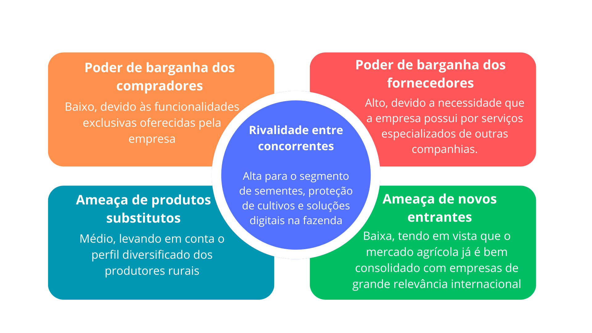  
Fonte: Material produzido pelos autores (2025).

#### **Rivalidade entre concorrentes**

&emsp; Em relação à concorrência no mercado agrícola, os rivais da Bayer Crop Science podem ser divididos entre o ramo de sementes, proteção de cultivos e soluções digitais.

&emsp; No que diz respeito à área de sementes, a rivalidade entre os concorrentes é alta, uma vez que há grandes companhias atuando nesse ramo. A exemplo disso, pode-se citar empresas como: DowDuPont Inc., Syngenta AG, Groupe Limagrain e KWS SAAT SE [9].

&emsp; No que se refere ao mercado de proteção de cultivos, a rivalidade entre concorrentes também é alta, já que existem diversas empresas grandes disputando nessa área. Dentre as principais empresas, cita-se: Syngenta Crop Protection, BASF, Corteva, entre outras [2].

&emsp; Com relação ao ramo de soluções digitais na agricultura, a rivalidade entre concorrentes é alta, visto que é um mercado dominado por big techs. Exemplificando, essa área é dominada pelas empresas AGCO Corporation, Deere & Company, IBM Corporation e Microsoft [8].

#### **Poder de barganha dos compradores**

&emsp; O poder de barganha dos clientes é baixo, visto que os produtos oferecidos pela Bayer Crop Science oferecem funcionalidades e tecnologias exclusivas que reduzem a sensibilidade dos clientes ao preço. Exemplificando, há o programa de fidelidade Impulso Bayer, na qual é possível trocar pontos por recompensas [5], e o produto FieldView apresenta ferramentas tecnológicas únicas para o produtor rural [4]. Assim, os fatores técnicos e as exclusividades que a empresa oferece são decisivos para motivar a compra dos consumidores.

#### **Poder de barganha dos fornecedores**

&emsp; O poder de barganha dos fornecedores é alto, devido à necessidade que a empresa possui por serviços especializados de outras companhias. Acerca disso, no ramo de sementes, como exemplo há o Agroeste e Dekalb; na proteção de cultivos, existem a Curbix, Sivanto e outros; além disso, nas soluções digitais, pode-se citar o The Climate Corporation com a plataforma agrícola Climate FieldView [3].

#### **Ameaça de produtos substitutos**

&emsp; A ameaça de produtos substitutos é média, levando em conta o perfil diversificado dos produtores rurais. Embora uma grande quantidade de produtores rurais optem por serviços já usados cotidianamente, percebe-se que atualmente há uma crescente adoção de soluções digitais e novas tecnologias nos campos agrícolas. Dessa forma, percebe-se a mudança de perfil dos consumidores, aceitando o emprego de novos produtos em suas propriedades [1].

#### **Ameaça de novos entrantes**

&emsp; A ameaça de novos entrantes é baixa, tendo em vista que o mercado agrícola já é bem consolidado com empresas de grande relevância internacional. Sob esse contexto, o ramo agrícola é de alta competitividade no nível mundial, na qual empresas como a própria Bayer Crop Science, Corteva, Phos Agro, AGCO, Sime Darby Plantation e outras companhias disputam um lugar de destaque. Por conseguinte, apesar do crescimento constante, o mercado agrícola é de difícil acesso para novos entrantes em todas as áreas de atuação do agronegócio [6].

### 2.1.2. Análise SWOT da Instituição Parceira (sprint 1)

&emsp; A Bayer CropScience é líder no agronegócio por seu ecossistema completo e forte presença no mercado, com destaque para o FieldView, solução digital que a diferencia da concorrência. No entanto, seu foco em grandes produtores pode limitar seu alcance entre pequenos agricultores. A empresa enfrenta ameaças como questões ambientais e processos legais, que afetam sua reputação. Por outro lado, há oportunidades na expansão de soluções sustentáveis, como o projeto PRO Carbono, e parcerias com universidades, fortalecendo sua inovação e presença no setor frente a concorrentes com tecnologias emergentes.

Figura 2: Análise SWOT da Bayer Crop Science.

Fonte: Material produzido pelos autores (2025).

### 2.1.3. Solução (sprints 1 a 5)

&emsp; A solução baseia-se em uma parceria com a Bayer, que oferece uma ferramenta chamada Climate FieldView — um sistema de software e hardware utilizado para coletar dados de máquinas agrícolas e monitorar a saúde das lavouras. No entanto, essa ferramenta apresenta dificuldades em sua instalação e manuseio por parte dos PTDs (Promotores Técnicos Digitais), uma vez que esses profissionais nem sempre possuem a capacitação técnica necessária para realizar um trabalho eficiente e satisfatório.

#### Problema a ser resolvido:  
&emsp; Devido a alta rotatividade dos PTDs, os responsáveis pela instalação do Climate FieldView, eles acabam sendo direcionados para atuar a instalação sem a devida capacidade técnica e, consequentemente, acarretam na insatisfação dos clientes que adquiriram o produto e sobrecarrega o atendimento remoto já que o presencial não está sendo efetivo.

#### Dados disponíveis:
&emsp; Não se aplica devido à falta de informações concretas e dados estatísticos sobre o tema, tendo sido fornecidas apenas as complicações mencionadas pelo cliente. 

#### Solução proposta:  
&emsp; Para resolver o problema, foi criada uma plataforma de capacitação com módulos voltados ao uso do Climate FieldView pelos PTDs. Um sistema de ranking avalia o desempenho dos usuários, enquanto uma página administrativa permite aos gestores acompanharem o progresso individual e coletivo, garantindo maior eficiência no aprendizado e na atuação técnica.
     
#### Forma de utilização  da solução:  

&emsp; A plataforma possui módulos com aulas e testes para capacitar o PTD no uso do Climate FieldView. Um teste inicial identifica pontos de atenção, e há um sistema de pesquisa rápida para dúvidas urgentes. O progresso é validado com pontuação, permitindo que o administrador acompanhe o nível de conhecimento de cada usuário.

#### Benefícios esperados:  

&emsp; Com a plataforma em funcionamento e os estudos concluídos, espera-se que os PTDs estejam aptos para atuar em campo com as habilidades necessárias, entregando um serviço eficaz e satisfatório, sem sobrecarregar outras áreas ligadas ao Climate FieldView, como o atendimento remoto, ou desperdiçar tempo que poderia ser utilizado de forma mais produtiva.

#### Critério de sucesso e como será avaliado:  

&emsp; Com a efetiva atuação da plataforma espera-se que os PTDs estejam preparados para a sua área de atuação e execução de suas atividades de maneira direta e ágil. Como critério de avaliação será possível perceber uma diminuição na sobrecarga do atendimento remoto e uma melhor avaliação dos clientes sobre a atuação dos PTDs.

### 2.1.4. Value Proposition Canvas (sprint 1): 

&emsp; Segundo Pereira[10], o modelo de negócio criado por Alexander Osterwalder, Yves Pigneur e Alan Smith denominado “Value Proposition Canvas” é uma ferramenta desenhada para garantir que o produto atenda às necessidades dos clientes, traga-lhes benefícios e resolva seus problemas, estruturando como o serviço agrega valor a eles. Para isso, a ferramenta utiliza duas seções do Business Model Canvas, a saber: “Segmentos de Clientes” e “Propostas de Valor”.

&emsp; Nesse sentido, o Value Proposition Canvas tem dois lados. À direita está um perfil apresentado pelo cliente mostrando suas tarefas, suas dores e seus ganhos. O lado esquerdo inclui a proposta de valor que deve ser entregue ao cliente, abrangendo produtos e serviços, criadores de benefícios e analgésicos (este é o mapa de valor)[10].

&emsp; Portanto, é importante descrever o conceito geral de cada tópico, mostrar a relação entre eles e como eles se afetam direta ou indiretamente. Portanto, os tópicos subsequentes abordarão elementos inerentes ao Value Proposition Canvas da solução proposta para o projeto atual, iniciando pelo perfil do cliente. Além disso, a Figura 3 mostra esses elementos visualmente:

Figura 3: Canvas proposta de valor do projeto FieldView.
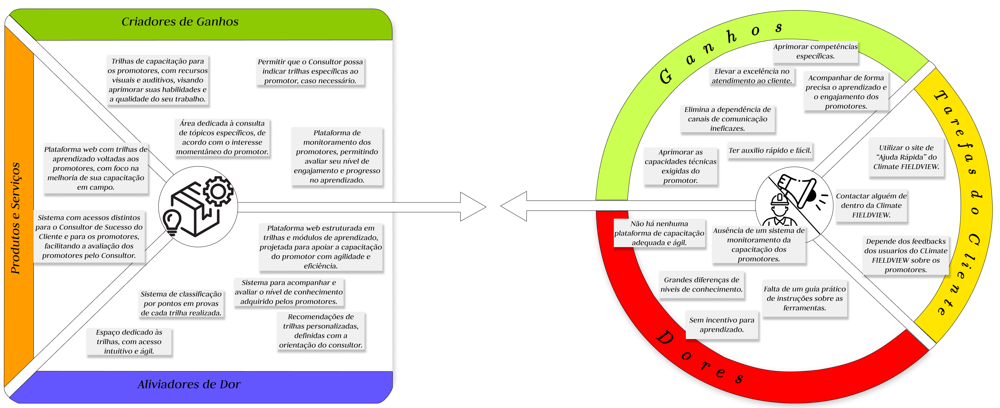
Fonte: Material produzido pelos autores (2025).

#### Tarefas do Cliente

&emsp; Neste tópico, deve-se observar o que o cliente já faz no seu dia a dia antes da proposta de solução, auxiliando no entendimento de como é possível agir perante a problemática em questão[10].. No contexto da capacitação de promotores, o cliente realiza as seguintes tarefas:

- **Utilizar o site de “Ajuda Rápida” do Climate FIELDVIEW:** O PTD(Promotor Técnico Digital) depende de um site que não foca em ensinar adequadamente ele sobre o uso do Climate FieldView.

- **Contactar alguém de dentro da Climate FIELDVIEW para buscar suporte:** Quando não consegue receber a ajuda do site de “Ajuda Rápida”, é exigido que ele solicite contato com assistência da própria Climate FieldView, de forma que se torna um trabalho mais demorado e insatisfatório para o cliente, que seria o fazendeiro.

- **Depender dos feedbacks dos usuários do Climate FIELDVIEW sobre os promotores:** para que o Consultor de Sucesso do Cliente tenha ciência da capacitação e desempenho do PDT, ele necessita da avaliação do cliente, no caso o fazendeiro que contrata desse serviço. 

#### Ganhos

&emsp; No segmento de ganhos, são elencados todos os benefícios esperados pelo cliente, ou seja, suas aspirações em relação ao seu contexto. Esta parte foca naquilo que o cliente almeja alcançar no escopo em questão, devendo cada ganho ser viabilizado por um criador de ganho correspondente[10]. Assim, foram identificados os seguintes ganhos:

- **Aprimorar competências específicas:** com uma análise feita pelo Consultor de Sucesso do Cliente, ele pode mandar ao PTD especifico uma trilha que ele pode se preocupar mais. 

- **Elevar a excelência no atendimento ao cliente:** suprir a insatisfação dos clientes quanto ao atendimento do PTD’s.

- **Eliminar a dependência de canais de comunicação ineficazes:** evitar o uso de canais de comunicações como WhatsApp, estabelecendo um meio de comunicação oficial e seguro.

- **Melhorar as capacidades técnicas exigidas dos promotores:** trazer trilhas intuitivamente, que ensinem e capacitem os PDT’s a fazerem seu trabalho eficientemente.

- **Ter auxílio rápido e fácil:** fazer uma plataforma que tenha auxílios rápidos para os PTD’s em caso de dúvidas durante o trabalho. 

- **Acompanhar de forma precisa o aprendizado e o engajamento dos promotores:** parte feita para o Consultor de Sucesso do Cliente saber como ando o aprendizado dos Promotores.

#### Dores

&emsp; No segmento de dores, há a definição daquilo com que o cliente sofre em decorrência da falta de uma solução efetiva ao seu problema[10].. As dores identificadas foram:

- **Não há nenhuma plataforma de capacitação adequada e ágil:** não tem uma plataforma que torne os Promotores capacitados ou possa os ajudar rápido e efetivamente.

- **Ausência de um sistema de monitoramento da capacitação dos promotores:** o Consultor não sabe o nível de capacitação dos Promotores, enviados a campo.

- **Grandes diferenças de níveis de conhecimento entre promotores:** os Promotores mais velhos tem maior nível quanto ao quesito técnico que os mais novos.

- **Falta de um guia prático de instruções sobre as ferramentas:** os guias atuais não apresentam serem intuitivos e nem rápido de se entender.

- **Sem incentivo para aprendizado:** não há nada que traga vontade de aprender ao promotor, além de se tornar mais capacitado.

&emsp; A partir da identificação do perfil do cliente, é necessário mapear o melhor caminho pelo qual suas necessidades serão atendidas. Assim, explicitam-se os criadores de ganho, aliviadores de dor e os produtos e serviços propostos.

#### Produtos e Serviços

&emsp; No segmento de produtos e serviços, há a identificação daquilo que deve ser entregue ao cliente, por meio de funcionalidades definidas e claras [10]. No presente contexto, propõe-se:
Plataforma web com trilhas de aprendizado voltadas aos promotores, com foco na melhoria de sua capacitação em campo: trazer uma solução web, de fácil acesso.

- **Sistema com acessos distintos para o Consultor de Sucesso do Cliente e para os promotores, facilitando a avaliação dos promotores pelo consultor:** trazer uma área destinada ao consultor, para saber sobre os promotores, e outra para os promotores com suas trilhas a serem feitas.

- **Sistema de classificação por pontos em provas de cada trilha realizada:** Sistema de pontuação conquistada por meio de provas sobre as trilhas para dedicação maior pelos promotores.

- **Espaço dedicado às trilhas, com acesso intuitivo e ágil:** trazer trilhas de fácil entendimento e intuitivas para os promotores poderem seguir e aprender.

#### Criadores de Ganhos

&emsp; Os criadores de ganhos identificam o que será implementado para gerar satisfação ao cliente, estando conectados diretamente aos ganhos elencados no perfil do cliente [10]. Assim, temos:
Trilhas de capacitação para os promotores, com recursos visuais e auditivos, visando aprimorar suas habilidades e a qualidade do seu trabalho: trilhas com métodos de ensino diversos para auxiliar os PDT’s a serem capacitados e elevar sua qualidade de atendimento.

- **Permitir que o Consultor possa indicar trilhas específicas ao promotor, caso necessário:** permitir que os Consultores possam indicar trilhas a serem feitas para melhorar especificamente algumas capacitações dos Promotores, trazendo um meio de comunicação entre ambos.

- **Plataforma de monitoramento dos promotores, permitindo avaliar seu nível de engajamento e progresso no aprendizado:** permitir aos Consultores supervisionar como anda os Promotores e suas trilhas, se estão cumprindo adequadamente.

- **Área dedicada à consulta de tópicos específicos, de acordo com o interesse momentâneo do promotor:** área destinada a trazer um guia mais prático para caso haja maior necessidade quando os Promotores já estiverem atuando em campo.

#### Aliviadores de Dor

&emsp; Nos aliviadores de dor, ocorre a identificação do que pode suprir as dores anteriormente reconhecidas[10]. Nesse sentido, definem-se:

- **Plataforma web estruturada em trilhas e módulos de aprendizado, projetada para apoiar a capacitação do promotor com agilidade e eficiência:** plataforma intuitiva e de fácil acesso para os Promotores possam acessar e aprender com métodos diferentes.

- **Sistema para acompanhar e avaliar o nível de conhecimento adquirido pelos promotores:** apresentando um sistema de pontos para trazer maior competitividade entre os promotores junto de um incentivo para fazerem as trilhas e aprenderem.

- **Recomendações de trilhas personalizadas, definidas com a orientação do consultor:** o Consultor poder indicar aos Promotores que achar justo, trilhas que possam ser déficits ou sejam mais requisitadas que outras mais normais.

### 2.1.5. Matriz de Riscos do Projeto (sprint 1)

&emsp; A matriz de riscos é uma ferramenta essencial para identificar, avaliar e priorizar ameaças que podem impactar o projeto. A avaliação qualitativa de riscos utiliza uma matriz que integra frequência (probabilidade de ocorrência) e severidade (impacto econômico). Os riscos de alta severidade e frequência requerem atenção imediata, enquanto os de menor impacto podem ser monitorados com menor urgência. Essa priorização permite a distribuição eficaz de recursos para ações preventivas e corretivas, garantindo a continuidade do projeto.

Figura 4: Matriz de riscos e oportunidades do projeto.

Fonte: Material produzido pelos autores (2025)

&emsp; Para explicar os termos colocados na imagem acima, faremos um quadro de ameaças e de oportunidades descrevendo cada tópico, com a categoria que ela se encontra, a probabilidade de acontecer e o impacto que esse risco pode ocasionar no projeto.

Quadro 1: Descrição dos riscos do projeto.

| Risco                                                   | Categoria                          | Descrição                                                                                                                                     | Probabilidade | Impacto     |
|----------------------------------------------------------|------------------------------------|-----------------------------------------------------------------------------------------------------------------------------------------------|---------------|-------------|
| Falta de conhecimento em análise de dados               | Pessoas (falta de conhecimento)    | A equipe não possui muita experiência nessa área, podendo atrasar prazos ou até analisar errado os dados.                                   | 90            | Alto        |
| Conteúdo raso e de difícil entendimento nas trilhas     | Produto                            | A falta de uma implementação dos conteúdos nas trilhas de uma forma clara e intuitiva pode dificultar a função do site: aprendizado rápido. | 50            | Moderado    |
| Plataforma não funcionar sem rede de internet           | Técnico / Infraestrutura           | A dependência de conexão com a internet pode inviabilizar o uso da solução em regiões remotas ou com sinal instável.                        | 50            | Muito Alto  |
| PDTs não conseguirem utilizar a plataforma de maneira intuitiva | Produto / Usabilidade             | A complexidade da interface ou navegação pode impedir que os PDTs usem a plataforma corretamente, afetando a experiência e resultados.       | 30            | Alto        |
| Falta de conhecimento na área de back end               | Pessoas (falta de conhecimento)    | Habilidades limitadas em back end podem atrasar a construção de funcionalidades críticas e a progressão do trabalho.                        | 30            | Moderado    |
| Análise da empresa (Bayer CropScience)                  | Pesquisa                           | Análise bem feita do parceiro sem nenhum impeditivo ou dificuldade.                                                                         | 10            | Muito Baixo |
| Desentendimento entre a equipe                          | Relacionamento / Relação           | Conflitos interpessoais podem gerar impacto na produtividade e na continuidade do projeto.                                                   | 10            | Baixo       |

Fonte: Material produzido pelos autores (2025).

-  2. Oportunidades

Quadro 2: Descrição das oportunidades do projeto.

| Oportunidade                                | Categoria               | Descrição                                                                                         | Probabilidade | Impacto    |
|---------------------------------------------|-------------------------|-----------------------------------------------------------------------------------------------------|---------------|------------|
| Conhecer uma grande empresa internacional   | Rede de contatos        | Contato com a Bayer proporciona networking relevante e aprendizado sobre o mercado internacional, além de entender como é trabalhar para uma empresa grande pela primeira vez. | 90            | Alto       |
| Alto engajamento com o projeto              | Pessoas  | A equipe está motivada, o que fortalece o comprometimento e a dedicação ao projeto, aumentando a produtividade e a disposição para passar por dificuldades ou aprender e aplicar o que o projeto precisar.               | 90            | Muito Alto |
| Aprender novas tecnologias                  | Educacional / Técnico   | O projeto permite o contato com ferramentas e linguagens ainda não dominadas pelos membros, ampliando o conhecimento em áreas nas quais todos irão trabalhar futuramente e nos transformando em profissionais mais completos.       | 70            | Muito Alto |
| Ganho financeiro através da venda da ideia  | Financeira / Negócios   | A solução proposta pode gerar lucro no futuro caso seja viabilizada comercialmente.               | 70            | Alto       |
| Facilidade no aprendizado                   | Pessoas / Educacional   | A equipe tem boa capacidade de assimilação, o que faz com que a falta de conhecimento prévio, mesmo atrasando um pouco o andamento, não seja um impeditivo para a preparação de um ótimo projeto.  | 30            | Alto       |
| Conhecer um profissional agrícola           | Rede de contatos        | A interação com especialistas do campo traz aprendizado e feedback técnico valioso, ampliando o conhecimento e tornando-nos profissionais mais versáteis.             | 50            | Moderado   |

Fonte: Material produzido pelos autores (2025).

## 2.2. Personas (sprint 1)

&emsp; As personas mapeadas para o projeto representam os perfis centrais dos usuários que interagem diretamente com a solução proposta. As personas foram desenvolvidas com base nas necessidades do parceiro Bayer Crop Science e visam orientar decisões de design, funcionalidades e usabilidade da aplicação.

Figura 4: Representação da persona PTD Jorge Faria.

 
  Fonte: Material produzido pelos autores (2025). 

Figura 5: Representação da persona Consultor Odair Jamar.

  
  Fonte:  Material produzido pelos autores (2025). 

## 2.3. User Stories (sprints 1 a 5)

&emsp; As User Stories são um elemento essencial para o planejamento de um projeto, pois elas norteiam o grupo a realizar suas tarefas com base em uma das personas desenvolvidas pelo grupo. Assim, projetou-se as seguintes personas de acordo com os quadros abaixo:

Quadro 3: Informações da user story 01.

Identificação | US01
--- | ---
Persona | Promotor Técnico DIgital
User Story | "Como PTD, quero possuir a habilidade de realizar uma busca rápida sobre as informações para que eu consiga otimizar a resolução das minhas dúvidas."
Critério de aceite 1 | Dado que a barra de pesquisa esteja acessível,  E o usuário deseje procurar por um tópico específico,  Quando ele digitar e confirmar a pesquisa,  Então o conteúdo correspondente ao tópico deve ser apresentado a ele.
Teste de aceite 1 | Buscar por uma informação utilizando palavras-chave  Aceitou = Os conteúdos com as palavras-chave aparecem  Recusou = Nenhum conteúdo aparece ao usuário e uma mensagem de erro é mostrada.
Critério de aceite 2 | Dado que a barra de pesquisa esteja acessível, E o usuário deseje procurar por um tópico, Quando ele digitar uma palavra-chave sem saber o nome exato da trilha, Então a barra de pesquisa deve apresentar sugestões de trilhas relacionadas
Teste de aceite 2 | Buscar por uma informação utilizando palavras-chave que podem apresentar algum erro gramatical  Aceitou = Aparece a palavra com maior semelhança com a digitada e mostra o conteúdo correspondente  Recusou = Nenhuma palavra correspondente é identificada e nenhum conteúdo é retornado
Critérios INVEST | - A User Story é independente porque pode ser desenvolvida e entregue separadamente de outras histórias. - A User Story é negociável porque pode ser alterada de acordo com as necessidades do cliente e a capacidade da plataforma - A User Story é valiosa porque o PTD pode sanar as suas dúvidas de forma rápida, economizando tempo e satisfazendo o cliente. - A User Story é estimável porque oferece informações sobre os elementos necessários para a implementação da busca rápida, como a barra de busca, a apresentação de resultados, e os filtros de pesquisa. - A User Story é pequena porque não envolve uma gama de funcionalidades, mas foca apenas no processo de busca rápida. - A User Story é testável porque os critérios 

Fonte: Material produzido pelos autores (2025).

Quadro 4: Informações da user story 02.

Identificação | US02
--- | ---
Persona | Promotor Técnico Digital
User Story | "Como PTD, quero ter acesso a uma plataforma didática onde eu possa aprofundar tecnicamente meus conhecimentos para que eu possa exercer uma boa atividade em campo."
Critério de aceite 1 | Dado que a plataforma seja acessada, E o usuário deseje realizar um estudo técnico, Então ele deve conseguir encontrar trilhas e conteúdos relevantes para sua capacitação como Promotor Técnico Digital.
Teste de aceite 1 | Acessar uma trilha de conhecimento  Aceitou = Aparece os módulos presentes na trilha.  Recusou = Nenhum módulo é apresentado. 
Critério de aceite 2 | Dado que o Promotor Técnico Digital esteja com dificuldade técnica, E deseje realizar um estudo sobre o tema, Então ele deve conseguir acessar uma plataforma amigável e didática com conteúdos que o auxiliem na resolução da dificuldade.
Teste de aceite 2 | Consumir o conteúdo presente em um módulo dentro da trilha  Aceitou = Aparece o conteúdo ao clicar em um módulo  Recusou = Não aparece nenhum conteúdo no módulo.
Critérios INVEST | - A User Story é independente porque pode ser desenvolvida e entregue separadamente de outras histórias. - A User Story é negociável porque pode ser alterada de acordo com as necessidades do cliente e a capacidade da plataforma - A User Story é valiosa porque o PTD pode usar a plataforma para se capacitar, o que impacta diretamente na qualidade dos atendimentos e na satisfação do cliente. - A User Story é estimável porque é possível estimar o esforço do desenvolvimento com base na entrega das trilhas, na organização dos conteúdos e, consequentemente na usabilidade da plataforma. - A User Story é pequena porque não envolve uma gama de funcionalidades, mas foca apenas no processo de visualização e acesso às trilhas. - A User Story é testável porque os critérios de aceite ilustram situações claras que definirão a funcionalidade do acesso às trilhas e a sua objetividade.

Fonte: Material produzido pelos autores (2025).

Quadro 5: Informações da user story 03.

Identificação | US03
--- | ---
Persona | Consultor Digital
User Story | "Como Consultor, quero ter a possibilidade de atribuir trilhas para o meu time de PTDs desenvolver uma habilidade específica."
Critério de aceite 1 | Dado que o consultor acesse a plataforma com a função de administrador, Quando ele navegar para a seção de usuários, Então ele deve conseguir visualizar as informações de cada PTD individualmente, incluindo suas trilhas associadas.
Teste de aceite | Acessar o desempenho individual dos PTDs.  Aceitou = Aparece as informações acerca do progresso das trilhas e posição que o PTD se encontra.  Recusou = Os dados dos PTDs não aparecem para o consultor.
Critério de aceite 2 | Dado que o consultor acesse a plataforma com a função de administrador, Quando ele selecionar um PTD específico, Então ele deve conseguir direcionar trilhas individualmente para esse PTD.
Teste de aceite 2 | Atribuir trilhas ao PTD quando logado como administrador.  Aceitou = Ao entrar como administrador e apertar no botão de atribuir trilhas, na página de usuários, aparece uma tela para adicionar o prazo e então o PTD será notificado.  Recusou = Após apertar no botão de atribuir trilhas não aparece a tela de definir um prazo, ou após definir o prazo não aparece nenhuma notificação ao usuário.
Critérios INVEST | - A User Story é independente porque pode ser desenvolvida e entregue separadamente de outras histórias. - A User Story é negociável porque pode ser alterada de acordo com as necessidades do cliente e os objetivos do consultor. - A User Story é valiosa porque o consultor pode atribuir trilhas de maneira individual a cada PTD, o que eleva a performance individual e a capacitação da equipe. - A User Story é estimável porque oferece as informações necessárias para validação da funcionalidade e pode ser facilmente avaliada de acordo com o resultado dos PTDs. - A User Story é pequena porque não envolve uma gama de funcionalidades, mas foca apenas no processo de atribuição manual de trilhas. - A User Story é testável porque os critérios de aceite ilustram situações claras que definirão a funcionalidade de atribuição de trilhas.

Fonte: Material produzido pelos autores (2025).

Quadro 6: Informações da user story 04.

Identificação | US04
--- | ---
Persona | Promotor Técnico Digital
User Story | "Como PTD quero ter a possibilidade de me cadastrar na plataforma para conseguir acessar os conteúdos disponíveis."
Critério de aceite 1 | Dado que o PTD tenha um cadastro válido, Quando ele acessar a plataforma e inserir suas credenciais, Então ele deve conseguir realizar o login e visualizar os conteúdos disponíveis
Teste de aceite 1 | Acessar a plataforma como PTD pela primeira vez após ser cadastrado pelo administrador.  Aceitou = Usuário consegue entrar na plataforma acessando as informações cadastradas pelo administrador.  Recusou = Usuário não consegue entrar na plataforma com as informações cadastradas pelo administrado.
Critério de aceite 2 | Dado que o PTD tenha um cadastro ativo, Quando ele realizar o login, Então ele deve conseguir acessar seu perfil pessoal na plataforma.
Teste de aceite 2 | Acessar o perfil na plataforma.  Aceitou = Usuário aperta no botão de perfil e consegue ver suas informações.  Recusou = Ao apertar no perfil não aparece nada ao usuário em relação a suas informações.
Critérios INVEST | - A User Story é independente porque pode ser desenvolvida e entregue separadamente de outras histórias. - A User Story é negociável porque pode ser alterada de acordo com as necessidades do cliente e as necessidades do promotor técnico digital. - A User Story é valiosa porque o PTD possuirá um cadastro único para acessar os conteúdos e ter a sua conta registrada. - A User Story é estimável porque o desenvolvimento dessa funcionalidade é facilmente estipulado com base na aplicação em outras plataformas. - A User Story é pequena porque foca somente na funcionalidade de cadastro e login do usuário PTD. - A User Story é testável porque os critérios de aceite ilustram situações claras que definirão como funcionará o processo de cadastro e login.

Fonte: Material produzido pelos autores (2025).

Quadro 7: Informações da user story 05.

Identificação | US05
--- | ---
Persona | Promotor Técnico Digital
User Story | "Como PTD quero revisar meus conhecimentos sobre a plataforma periodicamente para não ter dúvidas sobre o produto posteriormente "
Critério de aceite 1 | Dado que o PTD já tenha realizado estudos na plataforma, E deseje continuar consolidando esse conhecimento, Quando ele acessar novamente o conteúdo, Então a plataforma deve apresentar recursos de revisão para trilhas concluídas  
Teste de aceite | Acessar uma trilha para revisar.  Aceitou = Acessa uma trilha já concluída e poder reler os materiais disponíveis e refazer as questões presentes no módulo.  Recusou = Ao acessar uma trilha já concluída o usuário não consegue acessar o conteúdo ou refazer as perguntas.
Critério de aceite 2 | Dado que o PTD já tenha realizado estudos na plataforma, E deseje focar nos tópicos com maior dificuldade, Quando ele acessar novamente a plataforma, Então a plataforma deve destacar os conteúdos em que o PTD teve pior desempenho.
Teste de aceite 2 | Acessar uma trilha não concluída com 100% de aproveitamento.  Aceitou = Ao acessar uma trilha concluída, o usuário poderá ver em qual módulo não conseguiu acertar a questão devido ao destaque que essa seção possui.  Recusar = Ao acessar uma trilha concluída o usuário não consegue saber em qual módulo ele errou alguma questão por não apresentar nenhum destaque.
Critérios INVEST | - A User Story é independente porque pode ser desenvolvida e entregue separadamente de outras histórias. - A User Story é negociável porque pode ser alterada de acordo com as necessidades do cliente e as vontades do promotor técnico digital. - A User Story é valiosa porque o PTD possuirá a opção de consolidar os seus conhecimentos, além de corrigir os seus erros anteriores. - A User Story é estimável porque o desenvolvimento dessa funcionalidade pode ser estipulada de acordo com as tecnologias que serão utilizadas durante o processo. - A User Story é pequena porque foca somente na funcionalidade de revisar os tópicos já concluídos pelo PTD. - A User Story é testável porque os critérios de aceite ilustram situações claras que definirão como funcionará a revisão dos usuários.

Fonte: Material produzido pelos autores (2025).

Quadro 8: Informações da user story 06.

Identificação | US06
--- | ---
Persona | Promotor Técnico Digital
User Story | "Como consultor, quero garantir que meu time de PTDs recém contratados estejam aptos para exercer uma boa atividade de auxílio em campo para melhorar a satisfação dos clientes."
Critério de aceite 1 | Dado que o PTD comece a atuar na área E entre na plataforma de ensino Quando entrar na empresa, Então realizará uma trilha de conhecimento básico
Teste de aceite 1 | Possuir uma trilha introdutória. Aceitou = Ao usuário PTD entrar na plataforma pela primeira vez, aparece uma trilha para ele concluir e então continuar os seus estudos em outras áreas. Recusou = Não aparece nenhuma trilha introdutória ao PTD ao entrar pela primeira vez no site.
Critério de aceite 2 | Dado que o PTD novato atenda um chamado E não saiba resolver algum problema Quando estiver com o cliente Então utilize a plataforma de ensino
Teste de aceite 2 | Acessar a plataforma para sanar uma dúvida.  Aceitou = Ao apertar na barra de pesquisa e digitar as palavras-chave, aparecem os resultados correspondentes.  Recusou = Ao apertar na barra de pesquisa e digitar as palavras-chave, não aparecem os resultados correspondentes junto a uma mensagem de erro.

Fonte: Material produzido pelos autores (2025).

Quadro 9: Informações da user story 07.

Identificação | US07
--- | ---
Persona | Consultor Digital
User Story | " Como consultor, quero ter a possibilidade de analisar separadamente o desempenho de cada um dos PTDs para que eu possa estar ciente do seu desenvolvimento individual."
Critério de aceite 1 | Dado que a plataforma seja acessada por uma conta admin E entre na página de análise individual de algum colega de equipe Quando quiser consultar as métricas desse parceiro Então aparecerá uma série de dados acerca do avanço dos estudos do PTD
Teste de aceite 1 | Acessar o desempenho individual de um PTD.  Aceitou = Ao selecionar um usuário da plataforma, o administrador acessa os dados relacionados ao progresso do PTD.  Recusou = Ao selecionar um usuário da plataforma, na conta de administrador, não aparece nenhuma informação do PTD.
Critério de aceite 2 | Dado que a plataforma seja acessada por uma conta admin E entre na página de análise individual de alguém do time Quando for consultar as trilhas com mais erros do colega de equipe Então aparecerá as questões e trilhas que o PTD teve o menor aproveitamento
Teste de aceite 2 | Acessar o desempenho do PTD em uma trilha específica.  Aceitou = Ao selecionar um usuário aparecerá as trilhas com a porcentagem de aproveitamento na trilha especificada.  Recusou = Ao selecionar um usuário não aparece nenhuma informação acerca do aproveitamento em uma determinada trilha.

Fonte: Material produzido pelos autores (2025).

Quadro 10: Informações da user story 08.

Identificação | US08
--- | ---
Persona | Promotor Técnico Digital
User Story | "Como PTD, quero ter a possibilidade de receber uma pontuação de acordo com o meu desempenho nas trilhas para que eu possa me avaliar em relação aos outros"
Critério de aceite 1 | Dado que a plataforma seja acessada por uma conta comum E seja realizada algum exercício sobre a plataforma Quando for finalizada uma trilha de conhecimento Então o usuário receberá pontos caso acerte a pergunta
Teste de aceite 1 | Atribuir pontos aos usuários que acertarem as perguntas ao final do módulo.  Aceitou = Ao submeter a opção correta, o usuário ganha pontos.  Recusou = Ao submeter a opção correta, o usuário não ganha pontos e aparece uma mensagem de erro.
Critério de aceite 2 |Dado que a plataforma seja acessada por uma conta comum E a página de perfil seja aberta Quando o usuário quiser ver suas informações Então aparecerá a pontuação atual do PTD
Teste de aceite 2  | Visualizar a pontuação do usuário
Aceitou = Aparece a pontuação do usuário PTD ao acessar seu perfil na plataforma.  Recusou = Não aparece nenhuma informação sobre a pontuação do usuário PTD na plataforma.

Fonte: Material produzido pelos autores (2025).

Quadro 11: Informações da user story 09.

Identificação | US09
--- | ---
Persona | nome da Persona
User Story | "Como consultor, quero saber quais pessoas do meu time estão mais engajadas em aprender sobre a plataforma para que eu possa incentivá-las no seu progresso."
Critério de aceite 1 | Dado o acesso ao site com uma conta admin E a página principal seja aberta Quando o consultor que quiser ver o desempenho geral de seus colegas Então um ranking será mostrado com todos os usuários da plataforma.
Teste de aceite 1 | Aparecer o ranking dos usuários ao administrador.  Aceitou = Ao acessar o site, aparece o top 5 de usuários no site com a opção de ver o ranking completo.  Recusou = Ao acessar o site, não aparece o top 5 de usuários.
Critério de aceite 2 | Dado que a plataforma seja acessada utilizando uma conta admin E a página inicial seja acessada Quando o consultor queira saber em qual posição está seu colega de time Então aparecerá em qual posição está o PTD junto a sua pontuação.
Teste de aceite 2 | Acessar a posição de um usuário em específico.  Aceitou = Ao acessar as informações de um PTD aparece em que posição ele ocupa no ranking.  Recusou = Ao acessar as informações de um PTD não aparece a posição dele e uma mensagem de erro é notificada.

Fonte: Material produzido pelos autores (2025).

Quadro 12: Informações da user story 10.

Identificação | US10
--- | ---
Persona | Promotor Técnico Digital
User Story | "Como PTD, quero que a plataforma me avise sobre as trilhas direcionadas pelo consultor a mim, além das atualizações dos conteúdos, para que eu possa me manter informado."
Critério de aceite 1 | Dado a plataforma seja acessada por uma conta comum E a página inicial seja acessada Quando o usuário quiser saber se possui alguma atualização ou atribuição de alguma trilha Então o botão de notificação estará com alguma indicação visual
Teste de aceite 1 | Acessar as notificações da plataforma.  Aceitou = Uma seção de notificações apresentará as últimas atualizações destinadas ao usuário.  Recusou = A seção de notificações não mostra nada ou não atualiza as suas informações com uma mensagem de erro aparecendo.
Critério de aceite 2 | Dado a plataforma seja acessada por uma conta comum E a aba de notificações seja acessada Quando o usuário quiser rever as atualizações do produto FieldView ou alguma trilha atribuída a ele Então aparecerá todas as notificações que o usuário recebeu nos últimos dias
Teste de aceite 2 | Acessar as últimas notificações do site. <nr>Aceitou = Aparece primeiro as notificações mais recentes no site.  Recusou = Não aparece as notificações mais recentes no início da seção

Fonte: Material produzido pelos autores (2025).

Quadro 13: Informações da user story 11.

Identificação | US11
--- | ---
Persona | Promotor Técnico Digital
User Story | "Como PTD, quero que a plataforma me disponibilize certificados de conclusão das trilhas para que eu possa comprovar meu conhecimento"
Critério de aceite 1 | Dado a plataforma seja acessada por uma conta comum E alguma trilha seja completa Quando terminar de consumir o material didático e realizar as avaliações Então uma mensagem de parabéns aparecerá junto a um botão para baixar um certificado da trilha
Teste de aceite 1 | Adquirir o certificado.  Aceitou = Ao completar uma trilha, uma mensagem de parabéns com um botão para o usuário baixar o certificado.  Recusou = Ao completar uma trilha, nenhuma parabenização ou certificado não aparece e uma mensagem de erro é apresentada. 
Critério de aceite 2 | Dado a plataforma seja acessada por uma conta comum E a aba de certificados seja acessada Quando o usuário quiser rever o seu certificado Então aparecerá quais trilhas foram completas junto a um botão para baixar o certificado.
Teste de aceite 2 | Acessar os certificados adquiridos.  Aceitou = Ao acessar o perfil será possível visualizar quais certificado foram adquiridos pelo PTD.  Recusou = Ao acessar o perfil, nenhum certificado é disponibilizado e uma mensagem de erro aparece.

Fonte: Material produzido pelos autores (2025).

Quadro 14: Informações da user story 12.

Identificação | US12
--- | ---
Persona | Consultor Digital
User Story | "Como consultor quero poder adicionar novas trilhas na plataforma para que eu possa complementar o acervo de conhecimento do site"
Critério de aceite 1 | Dado que a plataforma seja acessada por uma conta admin E haja a necessidade de adicionar uma nova trilha de conhecimento Quando ocorrer alguma atualização no FieldView Então o consultor poderá upar os materiais didáticos acerca das novas funcionalidades no produto.
Teste de aceite 1 | Adicionar uma nova trilha.  Aceitou = Ao apertar um botão de adicionar nova trilha, aparece uma tela para colocar todo conteúdo relacionado aos módulos.  Recusou = Ao apertar um botão de adicionar uma nova trilha, uma tela de erro aparece.
Critério de aceite 2 | Dado que a plataforma seja acessada por um conta admin E haja a necessidade de adicionar uma nova trilha de conhecimento Quando ocorrer algum problema com o produto que não haja nenhuma trilha sobre esse tópico Então o consultor poderá upar os materiais didáticos acerca das novas funcionalidades no produto.
Teste de aceite 2 | Adicionar uma nova trilha.  Aceitou = Ao apertar um botão de adicionar nova trilha, aparece uma tela para colocar todo conteúdo relacionado aos módulos.  Recusou = Ao apertar um botão de adicionar uma nova trilha, uma tela de erro aparece.

Fonte: Material produzido pelos autores (2025).

Quadro 15: Informações da user story 13.

Identificação | US13
--- | ---
User Story | "Como desenvolvedor eu quero entender completamente a área de negócios do projeto, para entregar um ótimo MVP"
Critério de aceite 1 | Dado que a solução seja entendida pelos desenvolvedores E seja iniciado o desenvolvimento do projeto Quando não haja brechas no entendimento do produto Então o grupo poderá trabalhar corretamente
Teste de aceite 1 | Entender o projeto.  Aceitou = Todos os integrantes do grupo saberem desenvolver o trabalho seguindo a mesma linha de pensamento.  Recusou = Algum membro não desenvolver o projeto da maneira que foi discutida entre o grupo.
Critério de aceite 2 | Dado que a solução seja entendida pelos desenvolvedores E seja iniciado a documentação do projeto Quando não haja brechas no entendimento do produto Então o grupo poderá documentar o projeto corretamente.
Teste de aceite 2 | Entender o projeto.  Aceitou = Todos os integrantes do grupo saberem documentar o trabalho seguindo a mesma linha de pensamento.  Recusou = Algum membro não documentar o projeto da maneira que foi discutida entre o grupo.

Fonte: Material produzido pelos autores (2025).

# 3. Projeto da Aplicação Web (sprints 1 a 4)

## 3.1. Arquitetura (sprints 3 e 4)

*Posicione aqui o diagrama de arquitetura da sua solução de aplicação web. Atualize sempre que necessário*

&emsp; A arquitetura de uma aplicação web consiste em uma representação gráfica de como os vários componentes da solução interagem entre si (HASH, 2025). Essa representação é importante para visualizar como funciona o relacionamento entre cliente e servidor, e como essas operações são executadas por outras partes da plataforma web. Dessa maneira, é importante projetar o modo como ocorrerá essas interações para então inicar a construção da solução Web.

&emsp; Com base nessa perspectiva, a arquitetura Model-View-Controller (MVC) foi aplicada à plataforma, na qual cada parte dessa organização é responsável por uma tarefa distinta. Essa arquitetura foi criada em 1979 pelo cientista da computação norueguês Trygve Reenskaug, com a proposta de separar o projeto em camadas para reduzir as dependências entre elas (COODESH). Assim, os elementos dessa organização são separados em:

- Model (Modelo): Realiza a manipulação das informações no banco de dados, fazendo parte do backend da aplicação.

- View (Visualização): Responsável pela interação com o usuário, fazendo parte do frontend da plataforma.

- Controller (Controlador): Faz a intermediação entre as duas camadas, levando requisições e respostas entre elas, fazendo parte do backend do projeto.

&emsp; Dessa maneira, realizou-se o seguinte diagrama da arquitetura MVC do Field Review no draw.io:

Figura : Arquitetura da plataforma Field Review no draw.io.

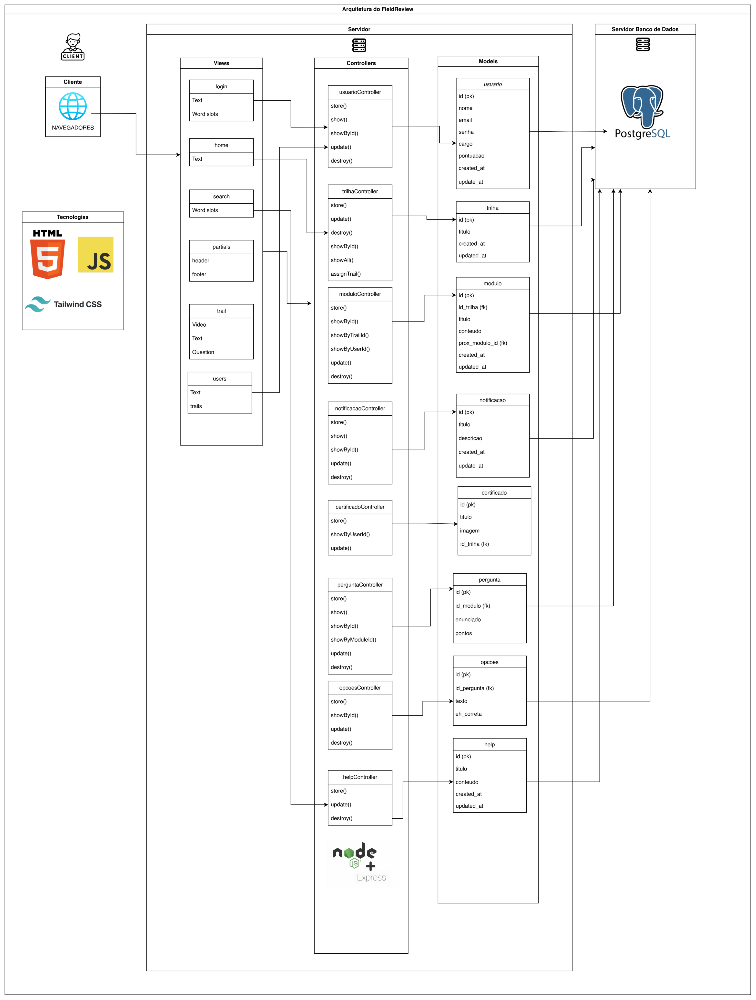

Fonte: Material produzido pelos autores (2025). 

[Clique aqui para melhor visualização](https://drive.google.com/file/d/1bAWjgLLZlXq5cCn7E9oCHs4irSq8bSpP/view?usp=sharing)

&emsp; Além disso, realizou-se esse diagrama utilizando o mermaid.js:

Figura : Arquitetura da plataforma Field Review no mermaid.io.

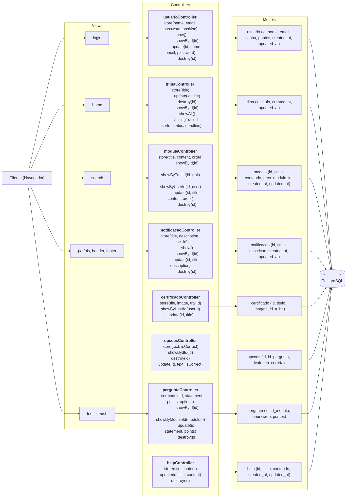

Fonte: Material produzido pelos autores (2025). 

[Clique aqui para melhor visualização](https://www.mermaidchart.com/raw/7c0065d3-4be8-42f4-aaed-b6566dc10b2e?theme=light&version=v0.1&format=svg)

- ***Descrição das camadas***

Sobre as camadas da aplicação, a divisão ocorreu de acordo com a arquitetura MVC:

 *Models*

&emsp; Essa parte representa as entidades que realizam as operações com o banco de dados (PostgreSQL), são eles:

- **usuario:** gerenciamento dos dados de usuários da plataforma.
- **trilha:** armazenamento das trilhas de aprendizagem disponíveis.
- **modulo:** módulos de aprendizado vinculados às trilhas.
- **pergunta:** questões de avaliação associadas aos módulos.
- **opcoes:** alternativas de resposta vinculadas às perguntas.
- **certificado:** dados sobre certificados gerados.
- **notificacao:** notificações enviadas aos usuários.
- **help:** conteúdo de ajuda rápida para navegação na plataforma.

 *Controllers*

&emsp; Os elementos responsáveis por fazer a comunicação do frontend com a manipulação do banco de dados são:

- **usuarioController:** gerencia criação, visualização, edição e exclusão de usuários.
- **trilhaController:** controla as operações relativas às trilhas.
- **moduloController:** executa as ações de CRUD nos módulos de aprendizado.
- **notificacaoController:** gerencia notificações dentro da plataforma.
- **certificadoController:** gerencia certificados dos usuários.
- **perguntaController:** gerencia as questões associadas aos módulos.
- **opcoesController:** controla as alternativas de resposta.
- **helpController:** gerencia o conteúdo de ajuda rápida.

 *Views*

&emsp; Os elementos de visualização da plataforma são os seguintes:

- **login**: tela de login na plataforma.
- **home**: tela inicial da aplicação.
- **search**: a tela de pesquisa na plataforma.
- **partials**: os elementos comuns em diversas telas como o header e o footer.
- **trails**: as trilhas e os seus respectivos conteúdos.
- **users**: a tela de gerenciamento dos usuários disponível aos administradores da plataforma.

 *Tecnologias*

&emsp; Em relação às tecnologias utilizadas na aplicação Web, foram aplicadas as seguintes ferramentas: 
- **HTML**: marcação semântica da plataforma. 
- **Tailwind CSS**: estilização das páginas.
- **JavaScript**: frontend da aplicação. 
- **Node.js + Express**: desenvolvimento da API e lógica backend, com organização em middlewares e rotas.
- **PostgreSQL**: sistema de gerenciamento de banco de dados relacional.

&emsp; Portanto, é notável como a utilização de uma arquitetura em uma aplicação organiza e distribui as tarefas de uma plataforma de maneira eficiente e que permita a continuidade do desenvolvimento por outros colaboradores.

## 3.2. Wireframes (sprint 2)

&emsp; O wireframe é uma representação esquemática inicial de uma interface de usuário, geralmente elaborada com baixa fidelidade. Seu objetivo principal é auxiliar na definição da estrutura e na disposição dos elementos visuais e informacionais da interface, sem, contudo, abordar em profundidade as funcionalidades ou aspectos estéticos do sistema. Essa ferramenta é amplamente utilizada nas etapas iniciais do design de interfaces, por permitir uma visualização clara da hierarquia da informação e da navegação pretendida, facilitando a comunicação entre designers, desenvolvedores e demais *stakeholders*.

 **Funcionalidades do Usuário Comum**  

#### Tela inicial do Usuário padrão

Figura 6: Tela desktop inicial do Promotor Técnico Digital

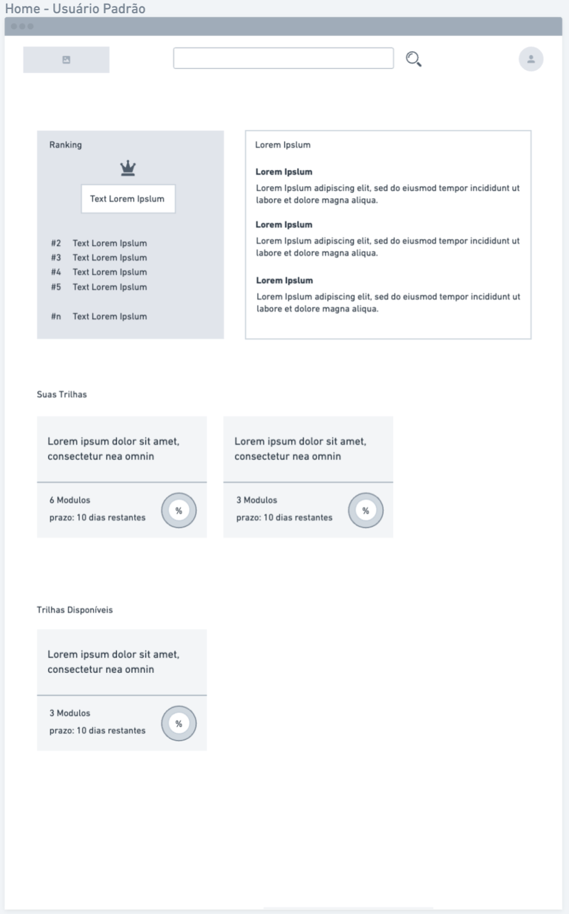
  Fonte: Material produzido pelos autores (2025) 

Figura 7: Tela mobile inicial do Promotor Técnico Digital

 
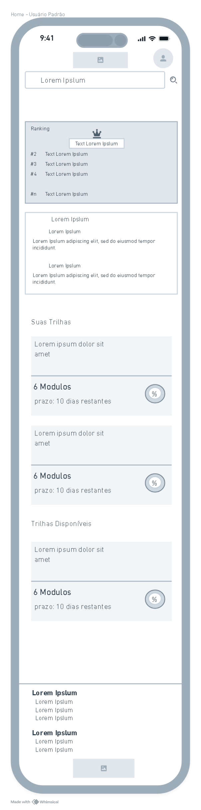
  Fonte: Material produzido pelos autores (2025) 

&emsp; Após realizar o login, a plataforma irá redirecionar para a tela correspondente à função do usuário: comum ou administrador. Na tela inicial do usuário, é possível observar o ranking geral e a sua posição, além de notificações sobre atualizações, trilhas já concluídas e trilhas disponíveis.

&emsp; Na interface inicial destinada ao usuário comum, são disponibilizadas as seguintes informações:

* Visualização do ranking geral dos usuários, incluindo a posição atual do usuário logado;  
* Notificações referentes a atualizações e eventos relevantes na plataforma;  
* Listagem das trilhas de aprendizagem já concluídas;  
* Exibição das trilhas disponíveis para realização;  
* Barra de pesquisa para busca de conteúdos.

#### Tela das trilhas

Figura 8: Tela desktop das trilhas do Promotor Técnico Digital

 
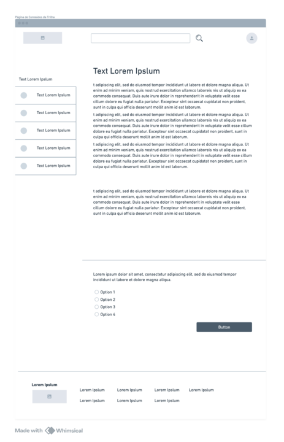
  Fonte: Material produzido pelos autores (2025) 

Figura 9: Tela mobile das trilhas do Promotor Técnico Digital

 
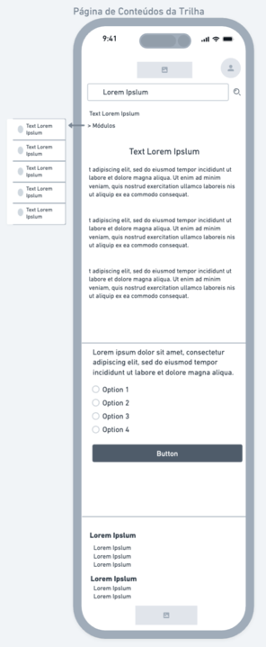
  Fonte: Material produzido pelos autores (2025) 

&emsp; Na listagem de trilhas exibida na página inicial, ao selecionar a trilha de interesse, o usuário é redirecionado para a interface específica da trilha escolhida. Nessa tela, são apresentados os módulos que a compõem, cada um contendo:

* Material de estudo relacionado ao tema do módulo;  
* Uma pergunta destinada à validação do conhecimento adquirido pelo usuário.

---

 **Funcionalidades do Administrador**

&emsp; Após realizar o login na função de administrador, a tela inicial exibe funcionalidades distintas em comparação à tela do usuário. Uma das principais diferenças é a presença de abas que permitem navegar entre as opções de 'Usuários' e 'Trilhas'.

#### Tela inicial do Administrador

Figura 10: Tela desktop inicial do Administrador

 
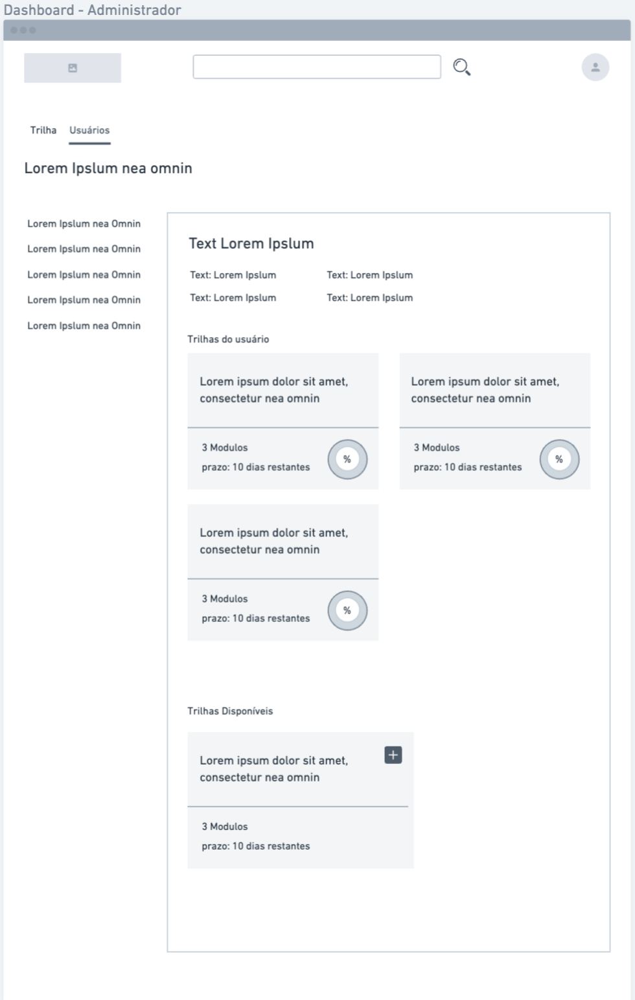
  Fonte: Material produzido pelos autores (2025) 

Figura 11: Tela mobile inicial do Administrador

 
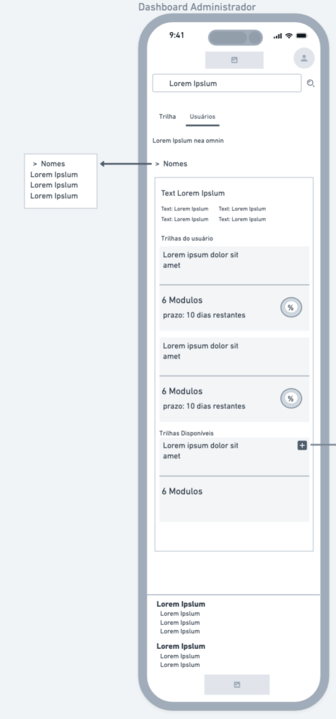
  Fonte: Material produzido pelos autores (2025) 

&emsp; Na aba de 'Usuários', o administrador tem acesso a uma tabela que exibe o ranking dos usuários, com a possibilidade de visualizar estatísticas individuais. Essas estatísticas incluem as trilhas já concluídas, a pontuação no ranking e a opção de recomendar trilhas que ainda não foram realizadas.

Figura 12: Fluxo de navagação entre as telas da plataforma web

 

  Fonte: Material produzido pelos autores (2025) 

&emsp; Representação de como ocorrerá o fluxo entre as telas dentro da aplicação. O wireframe é extremamente importante para a etapa inicial do desenvolvimento do projeto.

Segue o link do local onde foi desenvolvido o wireframe para visualização de todas as telas da aplicação: 
 https://whimsical.com/fieldreview-home-FCLJQWvMrHGbsAYkEbDkzE

## 3.3. Guia de estilos (sprint 3)

*Descreva aqui orientações gerais para o leitor sobre como utilizar os componentes do guia de estilos de sua solução*

### 3.3.1 Cores

Figura: Guia de Cores

 
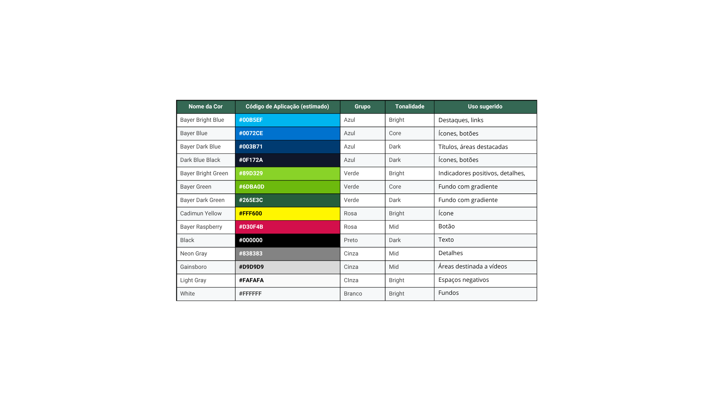
  Fonte: Material produzido pelos autores (2025) 

&emsp; Um guia de cores é um documento que define um conjunto padronizado de cores a serem usadas em uma interface digital, com o objetivo de garantir consistência visual, usabilidade e identidade da marca.

&emsp; No guia apresentado, as cores são organizadas por grupo cromático (como azul, verde, rosa, etc.), tonalidade (clara, média ou escura) e uso sugerido (como links, botões, textos ou fundos). Cada cor tem um código hexadecimal específico, o que facilita sua aplicação no desenvolvimento web. Além disso, o guia indica como utilizar cada cor de forma funcional — por exemplo, azul claro para links, verde brilhante para indicadores positivos, e preto para textos.

### 3.3.2 Tipografia

*Apresente aqui a tipografia da solução, com famílias de fontes e suas respectivas funções*

&emsp; A tipografia da aplicação Web é baseada no guia de marca da empresa Bayer, na qual a fonte Helvetica, amplamente utilizada pela Bayer em suas soluções tecnológicas e materiais online, foi adotada para garantir identidade visual e consistência.

&emsp; Com a adaptação da plataforma para desktop e dispotivos móveis, realizou-se um guia para a versão de computador e outro para celular. Dessa maneira, o guia tipográfico ficou da seguinte forma:

- **Guia de estilos tipográfico para o computador:**

Figura: Guia de estilos tipográfico do Field Review

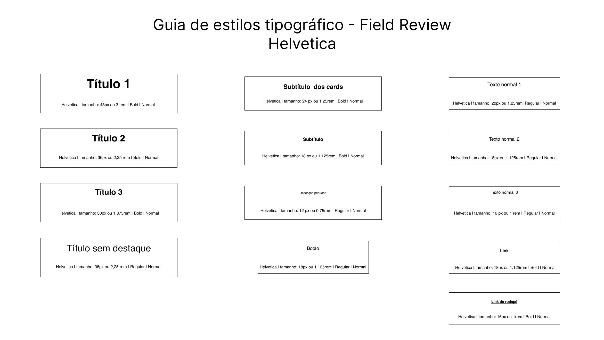

Fonte: Material produzido pelos autores (2025)

- **Guia de estilos tipográfico para celulares:**

Figura: Guia de estilos tipográficos mobile do Field Review

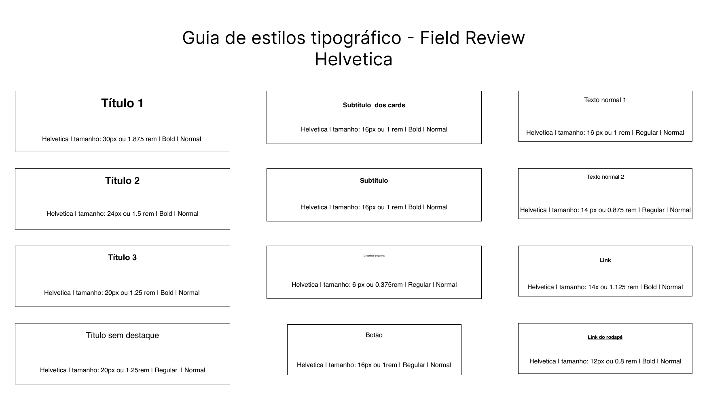

Fonte: Material produzido pelos autores (2025).

&emsp; Em relação a divisão dos tipos de fontes e suas respectivas aplicações, é possível dividí-los da seguinte maneira:

- Título 1: É o tipo utilizado nos principais títulos do site, com o tamanho de 48px ou 3 rem no desktop e 30px ou 1.875 no mobile, e peso bold.

- Título 2: É o tipo utilizado nos títulos secundários da plataforma, com o tamanho de 36px ou 2.25 rem no desktop e 24px ou 1.5 rem no mobile, e peso bold.

- Título 3: É o tipo utilizado nos títulos terciários da aplicação, com o tamanho de 30px ou 1.875 rem no desktop e 20px ou 1.25 rem no mobile, e peso bold.

- Título sem destaque: É o tipo utilizado para títulos informativos sem hierarquia visual, com o tamanho de 36px ou 2.25 rem no desktop e 20px ou 1.25 rem no mobile, e peso regular.

- Subtítulo dos cards: Mesmo uso do subtítulo geral, mas aplicado dentro de componentes como cartões, com o tamanho de 18px ou 1.125 rem no desktop ou 16 px ou 1 rem no mobile, e peso bold.

- Subtítulo: É o tipo utilizado como apoio aos títulos, destacando informações relevantes com o tamanho de 24px ou 1.25 rem no desktop e 16px ou 1 rem no mobile, e peso bold.

- Descrição pequena: É o tipo utilizado para descrições do rodapé, com o tamanho de 12px ou 0.75 rem no desktop e 6px ou 0.375 rem no mobile, e peso regular.

- Botão: É o tipo utilizado nos textos de botões interativos da plataforma, com o tamanho de 18px ou 1.125 rem no desktop ou 16px ou 1 rem no mobile, e peso regular.

- Texto normal 1: É o tipo utilizado para textos secundários ou de menor destaque, como descrições, com o tamanho de 20px ou 1.25 rem no desktop e 16px ou 1 rem no mobile, e peso regular.

- Texto normal 2: É o tipo utilizado para textos secundários ou de menor destaque, como descrições, com o tamanho de 18px ou 1.125 rem no desktop e 0.875 no mobile, e peso regular.

- Texto normal 3: É o tipo utilizado para o corpo principal do conteúdo, com o tamanho de 16px ou 1 rem no desktop e não há esse tipo no mobile, e peso regular.

- Link: É o tipo utilizado para links importantes dentro da aplicação, com o tamanho de 18px ou 1.125 rem no desktop e 14px ou 1.125 rem no mobile, e peso bold.

- Link do rodapé: É o tipo utilizado no rodapé da aplicação, com o tamanho de 16px ou 1 rem no desktop e 12px ou 0.8 rem , e peso bold.

&emsp; Para facilitar a visualização da tipografia do projeto, elaborou-se o seguinte quadro com o estilo, tamanho, peso e estilo da fonte e seu respectivo uso:

Quadro : Quadro de estilo tipográfico desktop do Field Review.

| Estilo               | Tamanho Desktop (px/rem) | Tamanho Mobile (px/rem) | Peso da fonte | Estilo da fonte | Uso                                                                 |
|----------------------|---------------------------|---------------------------|----------------|------------------|----------------------------------------------------------------------|
| Título 1             | 48px / 3rem               | 30px / 1.875rem           | Bold           | Normal           | Título principal do site                                             |
| Título 2             | 36px / 2.25rem            | 24px / 1.5rem             | Bold           | Normal           | Títulos secundários da plataforma                                   |
| Título 3             | 30px / 1.875rem           | 20px / 1.25rem            | Bold           | Normal           | Títulos terciários da aplicação                                     |
| Título sem destaque  | 36px / 2.25rem            | 20px / 1.25rem            | Regular        | Normal           | Títulos informativos sem hierarquia visual                          |
| Subtítulo dos cards  | 18px / 1.125rem           | 16px / 1rem               | Bold           | Normal           | Subtítulos dentro de componentes como cartões                       |
| Subtítulo            | 24px / 1.5rem             | 16px / 1rem               | Bold           | Normal           | Suporte aos títulos com informações de destaque                     |
| Descrição pequena    | 12px / 0.75rem            | 6px / 0.375rem            | Regular        | Normal           | Descrições do rodapé                                                |
| Botão                | 18px / 1.125rem           | 16px / 1rem               | Regular        | Normal           | Texto utilizado em botões interativos                               |
| Texto normal 1       | 20px / 1.25rem            | 16px / 1rem               | Regular        | Normal           | Texto secundário ou descrições breves                               |
| Texto normal 2       | 18px / 1.125rem           | 14px / 0.875rem           | Regular        | Normal           | Texto secundário com menos destaque                                 |
| Texto normal 3       | 16px / 1rem               | —                         | Regular        | Normal           | Corpo principal do conteúdo                                         |
| Link                 | 18px / 1.125rem           | 14px / 1.125rem           | Bold           | Normal           | Links importantes da interface                                      |
| Link do rodapé       | 16px / 1rem               | 12px / 0.8rem             | Bold           | Normal           | Links de menor destaque, localizados no rodapé da aplicação         |

Fonte: Material produzido pelos autores (2025).

### 3.3.3 Iconografia e imagens 

 &emsp; A iconografia e as imagens são componentes fundamentais no design de uma aplicação web, contribuindo para a experiência do usuário e a identidade visual do site melhorando seu aspecto visual e tornando-o mais convidativo e agradável de usar.

**Iconografia**

  &emsp; O uso de ícones padronizados na construção da identidade visual de uma plataforma é essencial para garantir consistência e facilitar a compreensão por parte dos usuários. Eles desempenham um papel importante na usabilidade, auxiliando na navegação e na interação com a interface do sistema.

  &emsp; O [Hero Icons](https://heroicons.com/) oferece uma ampla biblioteca de ícones gratuitos, compatíveis com qualquer página web. Além disso, a plataforma assegura a otimização e compatibilidade dos elementos, permitindo que o foco do desenvolvimento permaneça no conteúdo e no estilo do projeto. Por isso, optamos por integrar os ícones do Hero Icons em nosso projeto. Todos os ícones estão disponíveis nos formatos SVG e JSX.

  &emsp; Abaixo, apresentamos os ícones selecionados até o momento pela equipe de desenvolvimento. Para manter a padronização visual, todos foram escolhidos na versão "Solid".

Figura 13: Iconografia do Projeto

 
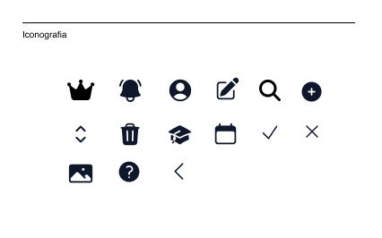
  Fonte: Material produzido pelos autores (2025) 

**Logo**

 &emsp; Além dos elementos mencionados no tópico anterior, é importante destacar o papel central que o logo da aplicação FieldReview desempenha em toda a plataforma. Desenvolvida com base nas cores primárias da Bayer (azul e verde) e elementos gráficos que remetem a logo do Climate FieldView, ele não apenas reflete visualmente o nome do projeto, mas também incorpora sua essência e propósito dentro do ecossistema de soluções Bayer/Climate FieldView. A presença consistente do logo ao longo da plataforma reforçará a identidade visual da marca, tornando-o instantaneamente reconhecível e associado com os valores e objetivos do FieldReview.

Figura 14: Logo do Projeto

 
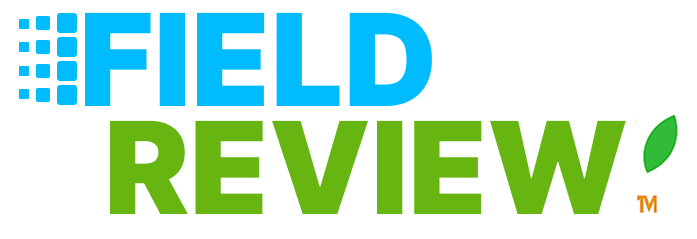
  Fonte: Material produzido pelos autores (2025) 

## 3.4 Protótipo de alta fidelidade (sprint 3)

&emsp; Para preparar a implementação do frontend da aplicação Web, realizou-se o seguinte protótipo de alta fidelidade:

Figura : Fluxo do protótipo de alta fidelidade.

Fonte: Material produzido pelos autores (2025).

[Link para visualização do figma](https://www.figma.com/design/CuM5byc293r9RMdnMkYXcJ/FieldReview?node-id=0-1&t=YpupKULCgRfJxEH8-1) 

&emsp; Para a realização do protótipo de alta fidelidade, utilizou-se o guia de estilos para guiar a elaboração das telas da plataforma. Além disso, realizou-se a divisão do fluxo do site em um caminho para o promotor técnico digital (PTD) e outra para o administrador.

&emsp; A primeira tela do site consiste no login e cadastro na plataforma, realizada de acordo com a US04 para suprir a necessidade do PTD entrar na plataforma para acessar o conteúdo. Assim, essa primeira tela ficou da seguinte maneira:

Figura : Tela de login da aplicação.

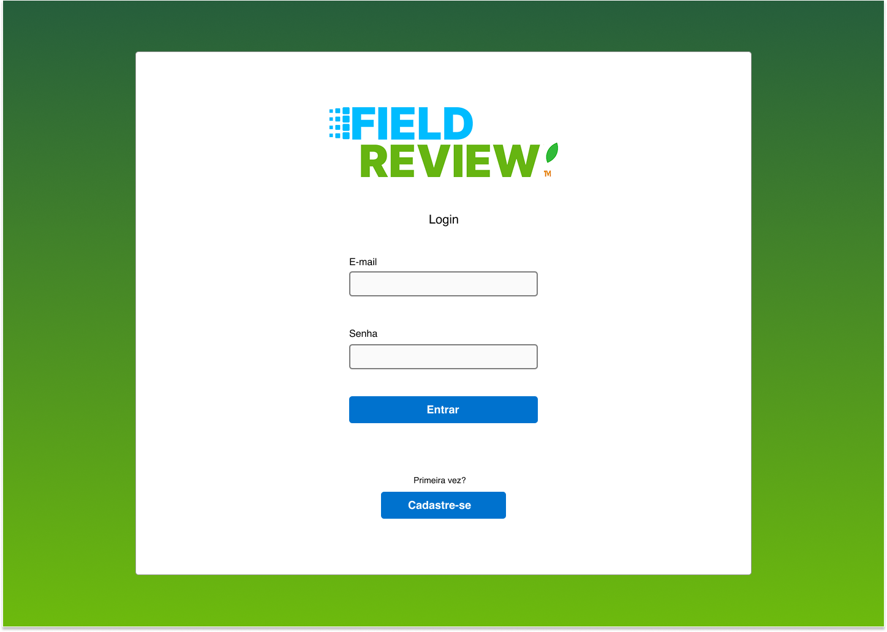

Fonte: Material produzido pelos autores (2025).

Figura: Tela mobile de login

 
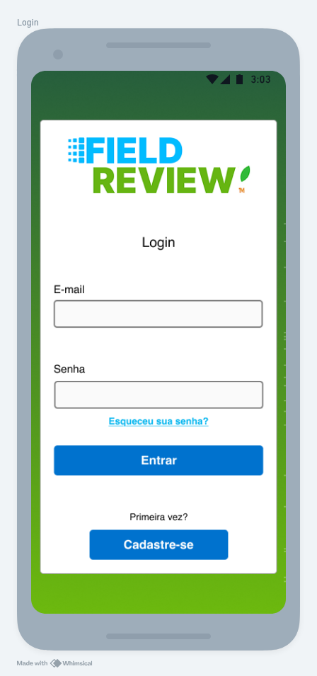
  Fonte: Material produzido pelos autores (2025) 

&emsp; É importante lembrar que essa tela é comum tanto para os PTDs quanto para os administradores. A partir dessa tela, de acordo com o cadastro do usuário, o fluxo é segmentado em um específico para os promotores e outro para o administrador, da seguinte maneira:

- **Promotor Técnico Digital**

&emsp; As telas direcionadas aos promotores estão relacionadas com as user stories essenciais: US01, US02 e US05, relacionadas à busca rápida para sanar dúvidas, o acesso a conteúdos das trilhas e o ato de revisar as trilhas depois. Dessa forma a apresentação das páginas será disposta em: tela inicial, tela de trilhas e a tela de pesquisa.

&emsp; A tela inicial compreende as principais informações da aplicação, apresentando o ranking dos usuários, as notificações, as trilhas que os usuários estão realizando e as trilhas que estão disponíveis, de acordo com a figura abaixo:

Figura : Tela inicial do usuário promotor.

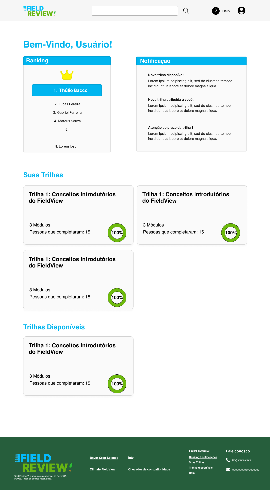

Fonte: Material produzido pelos autores (2025).

Figura: Tela mobile inicial do Promotor Técnico Digital

 
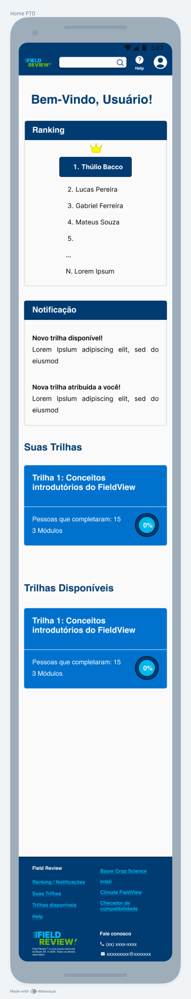
  Fonte: Material produzido pelos autores (2025) 

&emsp; Em relação à tela de trilhas, essa interface apresentará a disposição dos módulos na trilha, o vídeo e texto explicativo junto com a pergunta para validar o aprendizado. Além disso, é importante destacar que essa tela está relacionada a user story US02 com o acesso aos materiais disponíveis na plataforma. Dessa maneira, a tela está disposta da seguinte forma:

Figura : Página de trilhas do PTD.

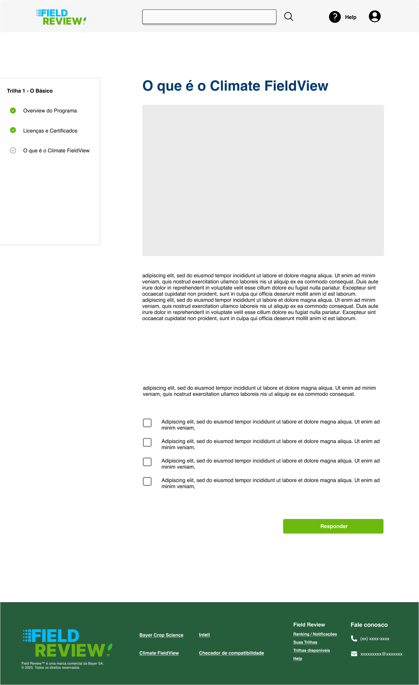

Fonte: Material produzido pelos autores (2025).

Figura: Tela mobile de trilhas do PTD

 
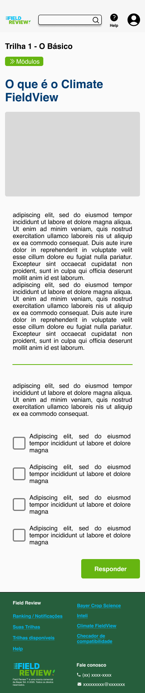
  Fonte: Material produzido pelos autores (2025) 

&emsp; No que diz respeito à tela de pesquisa, ela apresenta dois resultados de acordo com o texto inserido, uma área para os elementos de ajuda rápida da plataforma e outra parte para os resultados de acordo com as trilhas do site. Vale ressaltar que essa tela está relacionada à user story US01 com os resultados da busca rápida feita pelo promotor. Assim, a tela foi prototipada da seguinte maneira: 

Figura : Tela de pesquisa do PTD.

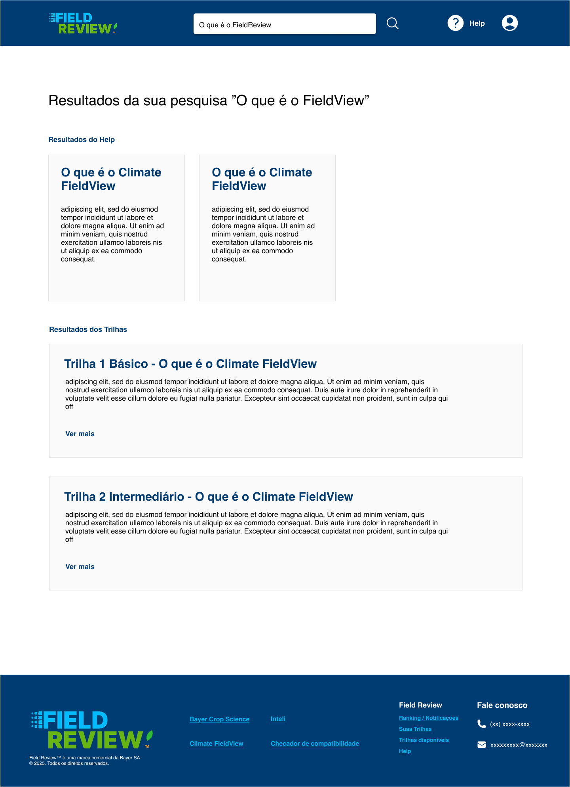

Fonte: Material produzido pelos autores (2025).

Figura: Tela mobile de pesquisas do PTD

 
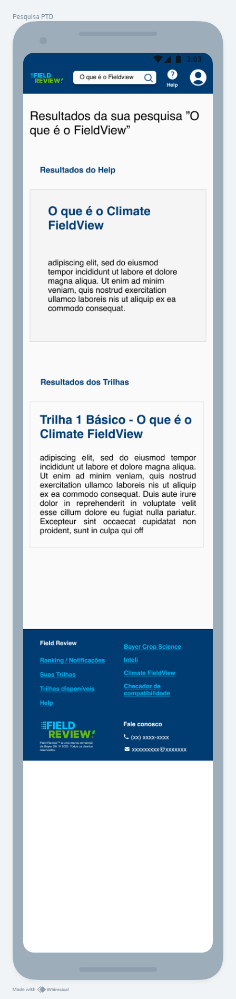
  Fonte: Material produzido pelos autores (2025) 

&smsp; A tela de ajuda tem como objetivo oferecer suporte rápido ao usuário por meio de uma seção de perguntas frequentes. Nela, são apresentados cards com dúvidas comuns, como "O que é o Climate FieldView", acompanhadas de respostas objetivas e fáceis de ler.

Figura : Tela de help do PTD.

Fonte: Material produzido pelos autores (2025).

Figura : Tela mobile de help do PTD.

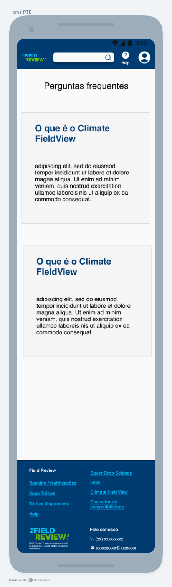

Fonte: Material produzido pelos autores (2025).

&emsp; Desse modo, as telas apresentadas foram prototipadas para resolverem as necessidades do promotor de com uma interface web assertiva com as suas necessidades.

- **Administrador**

&emsp; As telas direcionadas ao administrador da plataforma estão relacionadas diretamente à user story US03 de acordo com a vontade do consultor de atribuir trilhas aos seus colegas de equipe visando a capacitação técnica do time. Dessa maneira, as telas desse fluxo são: tela de trilhas, tela de alteração de uma trilha, tela de alteração de um módulo, tela de usuários e tela de atribuir uma trilha ao usuário.

&emsp; A tela de trilhas compreende as ações relacionadas a observar as trilhas disponíveis na plataforma e a possibilidade de adicionar uma nova trilha, de acordo com a figura abaixo:

Figura : Página de trilhas do administrador.

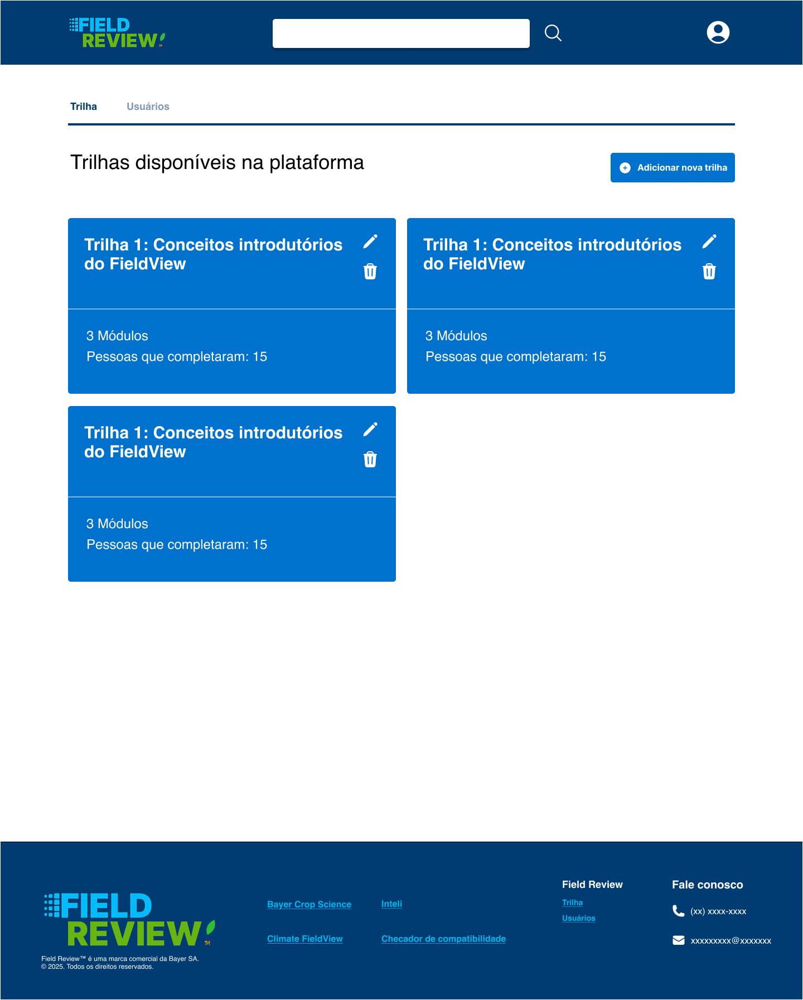

Fonte: Material produzido pelos autores (2025).

Figura: Tela mobile de trilhas do administrador.

 

  Fonte: Material produzido pelos autores (2025) 

&emsp; Em relação à tela de alteração das trilhas, nesse campo o usuário pode alterar o título do conteúdo e apagar ou atualizar ou criar um novo módulo, além de cancelar suas alterações ou salvá-las, assim representado na figura abaixo:

Figura : Página de editar trilha do administrador.

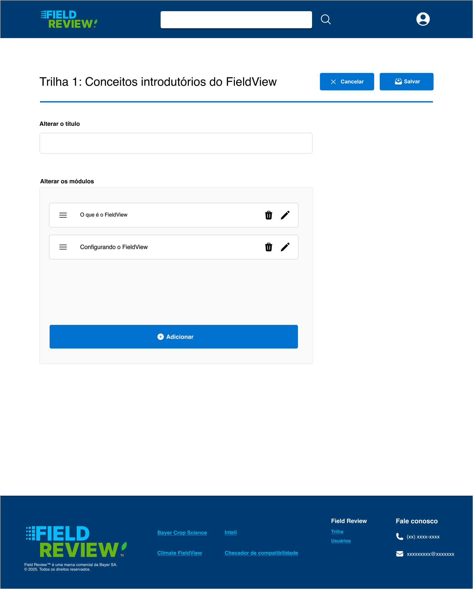

Fonte: Material produzido pelos autores (2025).

Figura: Tela mobile de editar trilha do administrador.

 
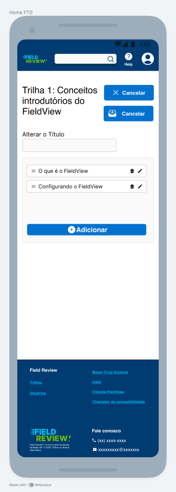
  Fonte: Material produzido pelos autores (2025) 

&emsp; Sobre a tela de editar o módulo, nela o usuário pode alterar o conteúdo e as perguntas do material selecionado, assim como é apresentado na imagem abaixo:

Figura : Página de editar módulos do administrador.

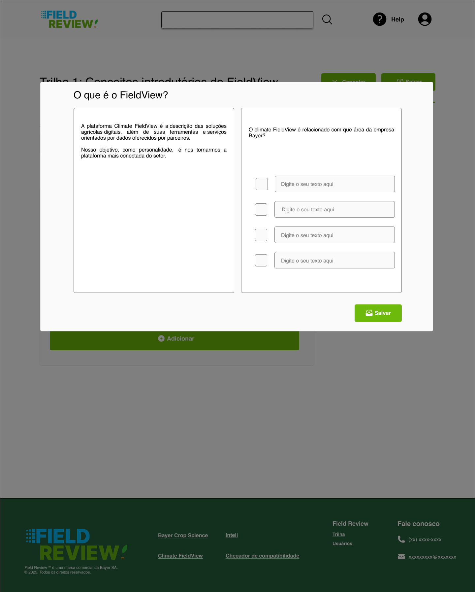

Fonte: Material produzido pelos autores (2025).

Figura: Tela mobile de editar módulos do administrador.

 
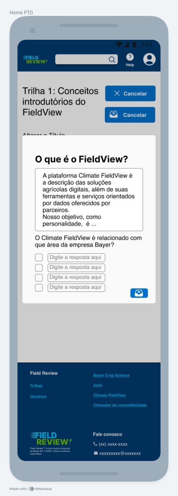
  Fonte: Material produzido pelos autores (2025) 

&emsp; No que diz respeito à tela de usuários, nela aparece todos os usuários cadastrados na plataforma, com a possibilidade do administrador poder ver progresso e atribuir trilhas ao usuário selecionado, assim como é apresentado na figura abaixo:

Figura : Tela de usuários do administrador.

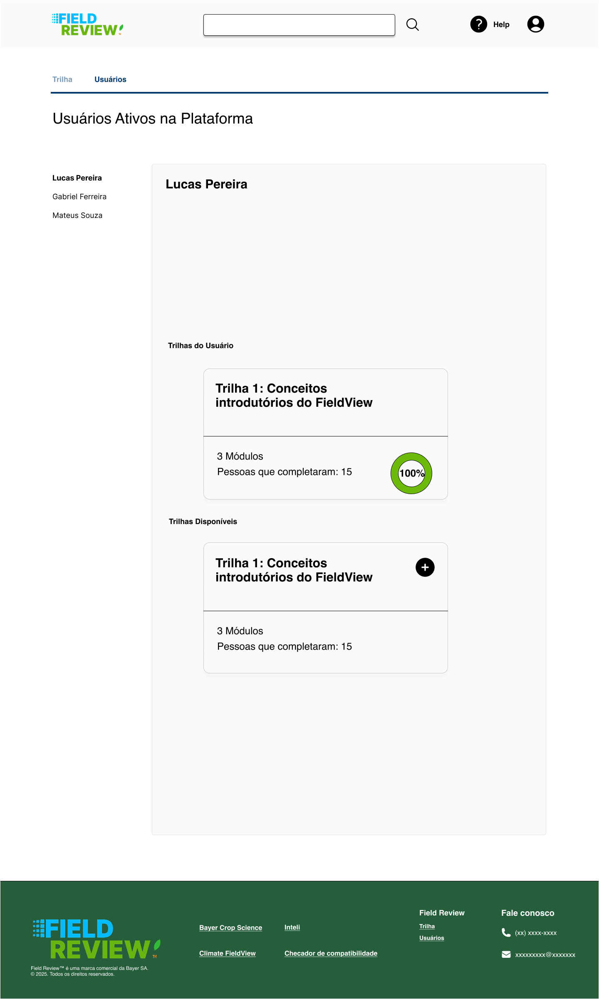

Fonte: Material produzido pelos autores (2025).

Figura: Tela mobile de usuários do administrador.

 
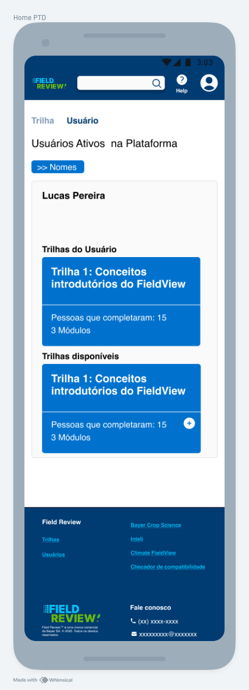
  Fonte: Material produzido pelos autores (2025) 

&emsp; Sobre a tela de atribuir uma
trilha ao usuários, nela o administrador define uma data para o PTD completar o conteúdo que ele considerou importante para o promotor realizar, de acordo com o protótipo abaixo: 

Figura : Página de confirmação de tempo.

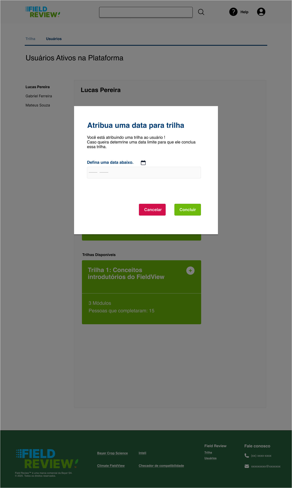

Fonte: Material produzido pelos autores (2025).

Figura: Tela mobile de confirmação de tempo.

 
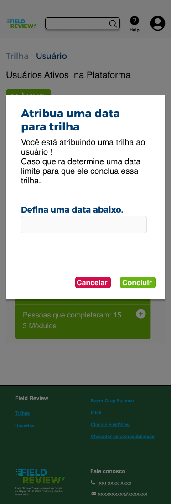
  Fonte: Material produzido pelos autores (2025) 

&emsp; A tela de administração do help permite ao administrador gerenciar as informações exibidas na seção de perguntas frequentes da plataforma. Nessa interface, é possível adicionar novos tópicos de ajuda, além de editar ou remover conteúdos já existentes.

Figura: Tela de help administrador.

 

  Fonte: Material produzido pelos autores (2025) 

Figura: Tela mobile de help administrador.

 
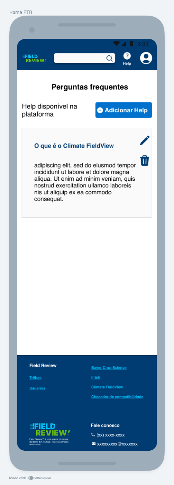
  Fonte: Material produzido pelos autores (2025) 

&emsp; A tela de edição do help permite ao administrador criar ou modificar cards de perguntas frequentes, inserindo título e conteúdo de forma rápida. 

Figura: Tela de edição do help administrador.

 

  Fonte: Material produzido pelos autores (2025) 

Figura: Tela mobile de edição do help administrador.

 
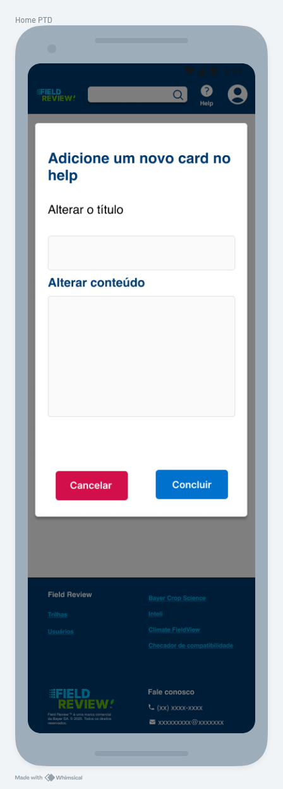
  Fonte: Material produzido pelos autores (2025) 

&emsp; Portanto, esse fluxo específico do administrador foi realizado para suprir as necessidades do consultor para gerenciar sua equipe de maneira mais eficiente e criar material de qualidade para os usuários.

## 3.5. Modelagem do banco de dados (sprints 2 e 4)

### 3.5.1. Modelo relacional (sprints 2 e 4)

&emsp; A seguir, apresenta-se o Diagrama de Entidade e Relacionamento (DER), que é o modelo lógico derivado da MER (Modelagem Entidade e Relacionamento), com a explicação de todas as entidades e seus respectivos relacionamentos. Este diagrama servirá como base para implementação do banco de dados do site.

&emsp; Para fins de organização, será apresentado todas as entidades primeiro e depois seus relacionamentos.

#### Entidades.

Figura 15: Entidade Usuário

 
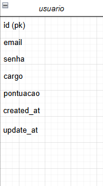
  Fonte: Material produzido pelos autores(2025) 

&emsp;A imagem acima refere-se à entidade **usuario**, cujos atributos são: **id**, gerado automaticamente após sua criação e que servirá para sua identificação, principalmente dentro do banco de dados; **nome**, fornecido pelo usuário durante o cadastro; **email**, utilizado para contato e para o recebimento de notificações; **senha**, também definida pelo usuário; **cargo**, responsável por diferenciar PTDs (quem fará as trilhas) e Administradores (quem recomenda usuários a fazerem trilhas); **pontuacao**, que representa a pontuação obtida pelo PTD após responder corretamente a uma pergunta de qualquer módulo (este atributo será null para Administradores, já que eles não fazem as trilhas); **created_at**, gerado quando a entidade Usuário é criada; e **updated_at**, responsável por registrar quando o usuário é atualizado.

Figura 16: Entidade usuario-trilha

 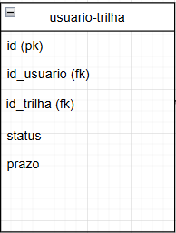
  Fonte: Material produzido pelos autores(2025) 

&emsp;&emsp; A imagem acima é a tabela intermediária **usuario-trilha**. Ela é criada porque o banco de dados não suporta uma relação N:N, assim se cria essa tabela com apenas o **ID próprio** e os **IDs das entidades relacionadas** (neste caso os IDs da entidade **usuario** e **trilha**), com o intuito de fazer a quebra da relação N:N, formando uma relação 1:N. Lém disso, temos atributos que relacionam as duas entidades, que são o **status**, que mostrará qual estágio de conclusão ela está, além do atributo **prazo** que mostrará para um certo Usuário qual prazo ele tem para fazer. 

Figura 17: Entidade usuario-certificado

 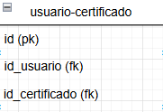
  Fonte: Material produzido pelos autores(2025) 

 &emsp; Seguindo o mesmo modelo da explicação acima, a entidade **usuario-certificado** também é criada porque a relação Usuário e Certificado é N:N. Os atributos dessa entidade é **ID próprio** e os **IDs das entidades relacionadas** (Usuário e Certificados).

Figura 18: Entidade usuario-notificacao

 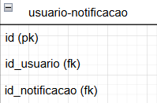
  Fonte: Material produzido pelos autores (2025) 

&emsp; Seguindo o mesmo modelo da explicação acima, a entidade **usuario-notificacao** também é criada porque a relação Usuário e Notificação é N:N. Os atributos dessa entidade é **ID próprio** e os **IDs das entidades relacionadas** (Usuário e Notificação).

Figura 19: Entidade usuario-modulo

 
  Fonte: Material produzido pelos autores (2025) 

&emsp; Seguindo o mesmo modelo da explicação acima, a entidade **usuario-modulo** também é criada porque a relação Usuário e Módulo é N:N. Os atributos dessa entidade é **ID próprio** e os **IDs das entidades relacionadas** (Usuário e Módulo), além do atributo **esta_completo** que será resposável por mostrar se o módulo foi completado pelo usuário.

Figura 20: Entidade certificado

 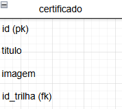
  Fonte: Material produzido pelos autores (2025) 

&emsp; A imagem acima é referente a tabela da entidade **certificado**, cujos atributos são: **ID próprio**; **titulo**, é o nome dado ao certificado; **descricao**, é a explicação do certificado, com detalhes e skills adquiridos por completar tal trilha; **imagem** guarda a representação visual do certificado; e por fim o **id_trilha**, esse atributo existe porque o certificado é o documento adquirido após completar com êxito alguma trilha, assim, o entidade certificado tem relação de dependência com a entidade trilha.

Figura 21: Entidade trilha

 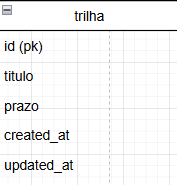
  Fonte: Material produzido pelos autores (2025) 

&emsp; A imagem acima é referente a tabela da entidade **trilha**, cujos atributos são: **ID próprio**; **titulo**, o nome da trilha referente; **prazo**, determinado pelo Administrador, cuja sua função é determinar um tempo para a conclusão de todos os módulos dentro desssa trilha; **created_at** gerado quando a entidade usuário é criada; e o **updated_at**, responsável por registrar quando o usuário é atualizado.

Figura 22: Entidade modulo

 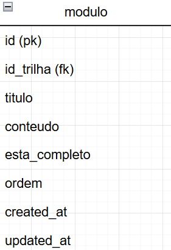
  Fonte: Material produzido pelos autores (2025) 

&emsp; A imagem acima é referente a tabela da entidade **modulo**, cujos atributos são: **ID próprio**; **id_trilha**, será responsável por fazer a relação de dependência de tal módulo a alguma trilha, ou seja, inserindo o módulo a uma trilha; **titulo**, o nome da trilha referente; **conteudo**, será responsável por guardar informações de vídeos, textos, PDFs, tudo referente ao conteúdo que deve ser ensinado nesse módulo; **esta_completo**, sua única função será verificar se a pergunta foi respondida, retornando como módulo completo ou não; **ordem**, para que os módulos fiquem organizados dentro da trilha; **created_at** é gerado quando o atributo usuário é criado; e o **updated_at** é responsável por registrar quando o usuário é atualizado.

Figura 23: Entidade pergunta

 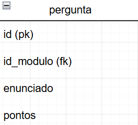
  Fonte: Material produzido pelos autores (2025) 

&emsp; A imagem acima é referente à tabela da entidade **perguntas**, cujos atributos são: **ID próprio**; **enunciado**, é a pergunta referente ao conteúdo do módulo; **id_modulos**, será responsável por fazer a relação de dependência da pergunta com o módulo correspondente; e **pontos**, refere-se aos pontos ganhos ao responder corretamente o enunciado.

Figura 24: Entidade opcoes

 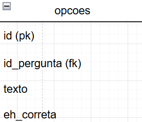
  Fonte: Material produzido pelos autores (2025) 

&emsp; A imagem acima é referente à tabela da entidade **opcoes**, cujos atributos são: **ID próprio**; **texto**, é o que estará escrito como potencial resposta para a pergunta correspondente; **id_perguntas**, será responsável por fazer a relação de dependência das opções com a pergunta correspondente; e **eh_correta** identifica se a alternativa é a resposta certa ou não.

Figura 25: Entidade notificacao

 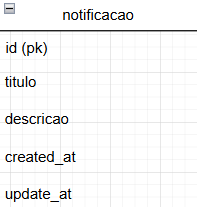
  Fonte: Material produzido pelos autores (2025) 

&emsp; A imagem acima é referente à tabela da entidade Notificação, cujos seus atributos são: **ID próprio**, **titulo**, o nome da trilha referente, **Descrição**, será a mensagem que a notificação carregará. Por fim,  **created_at** gerado quando a entidade usuário é criada e o **updated_at**, responsável por registrar quando o usuário é atualizado.

Figura 24: Entidade help

 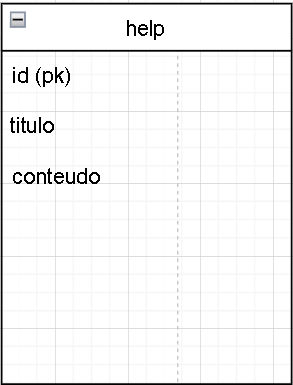
  Fonte: Material produzido pelos autores (2025) 

&emsp; A imagem acima é referente à tabela da entidade help, cujos atributos são: **ID próprio**, **titulo** que representa a pergunta do FAQ, e o **conteudo** que indica a resposta para a pergunta. Por fim, **created_at** e **updated_at** indicam quando que a entidade é criada e atualizada, respectivamente.

#### Relacionamento entre as Entidades

  
Figura 26: Modelo Entidade-Reçacionamento da aplicação web

 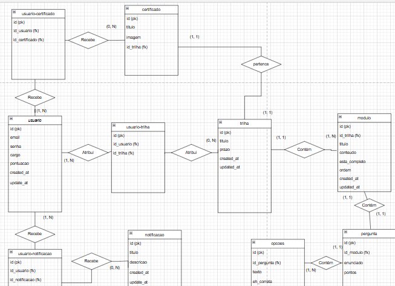
  Fonte: Material produzido pelos autores (2025) 

**1. usuário ↔ usuário_trilha**

- Tipo: 1:N (um usuário pode estar em várias trilhas)

- Tabela intermediária: usuario_trilha

- Motivo: Representa a inscrição de usuários em diferentes trilhas. Resolve a relação N:N entre usuários e trilhas, armazenando quais trilhas cada usuário está participando.

**2. usuário ↔ usuario_notificacao**

- Tipo: 1:N (um usuário pode receber várias notificações)

- Tabela intermediária: usuario_notificacao

- Motivo: Controla quais notificações foram enviadas para cada usuário, com dados adicionais como se a notificação foi lida e a data de recebimento.

**3. usuário ↔ usuario_certificado**

- Tipo: 1:N (um usuário pode ter vários certificados)

- Tabela intermediária: usuario_certificado

- Motivo: Associa usuários aos certificados que receberam, possibilitando o histórico de conquistas individuais.

**4. certificado ↔ trilha**

- Tipo: 1:1 (cada certificado pertence a uma única trilha)

- Relacionamento: pertence

- Motivo: Cada trilha pode gerar apenas um certificado, e esse vínculo direto é representado por uma relação 1:1.

**5. trilha ↔ módulo**

- Tipo: 1:N (uma trilha possui vários módulos)

- Relacionamento: contém

- Motivo: Uma trilha é estruturada por múltiplos módulos sequenciais, que representam o conteúdo a ser estudado ou realizado.

**6. módulo ↔ pergunta**

- Tipo: 1:N (um módulo pode ter várias perguntas)

- Relacionamento: contém

- Motivo: Cada módulo pode incluir múltiplas perguntas relacionadas ao seu conteúdo, permitindo avaliações por etapa.

**7. pergunta ↔ opções**

- Tipo: 1:N (uma pergunta tem várias opções)

- Relacionamento: contém

- Motivo: Permite a construção de perguntas de múltipla escolha, onde cada pergunta oferece diversas alternativas de resposta.

**8. usuário ↔ usuario-módulo**

- Tipo: 1:N (Usuário com vários módulos)

- Tabela intermediária: usuário-modulo

- Motivo: Associa usuário com módulo para que cada módulo tenha o status dela associada ao ID de um certo usuário. Assim, cada pessoa tem seus módulos e seus próprios status.

---

### 3.5.2. Consultas SQL e lógica proposicional (sprint 2)

&emsp; Nesta seção, apresentamos uma lista de consultas SQL compostas, implementadas no back-end da aplicação web, acompanhadas de sua lógica proposicional. Cada consulta inclui a expressão SQL, a proposição lógica correspondente e a tabela verdade que ilustra as combinações possíveis e os resultados esperados.

#### Consultas e Tabelas Verdade.

Quadro 16: Atualização do prazo para completar a trilha.

#1 | ---
--- | ---
**Expressão SQL** |  UPDATE usuario_trilha ut SET status = 'perdeu_prazo' WHERE ut.prazo < CURRENT_DATE AND NOT status = 'completo';
**Proposições lógicas** | $A$: O prazo é menor que 'CURRENT_DATE'(ut.prazo < CURRENT_DATE);  $B$: Status da trilha não está 'completo' (status  = 'completo');
**Expressão lógica proposicional** | $A \land \lnot B$
**Tabela Verdade** | <table> <thead> <tr> <th>$A$</th> <th>$B$</th> <th>$\lnot B$</th> <th>$A \land \lnot B$ </th> </tr> </thead> <tbody> <tr> <td>F</td> <td>F</td> <td>V</td> <td>F</td></tr> <tr> <td>F</td> <td>V</td> <td>F</td> <td>F</td> </tr> <tr> <td>V</td> <td>F</td> <td>V</td> <td>V</td> </tr> <tr> <td>V</td> <td>V</td> <td>F</td> <td>F</td></tbody> </table>

Fonte: Material produzido pelos autores (2025).

Contexto de aplicação da consulta 1: Cada trilha dentro da plataforma possui um prazo para ser concluída. Caso o usuário não conclua a trilha atribuída a ele dentro do prazo, o status da trilha é atualizado para 'perdeu_prazo'. Essa consulta é executada periodicamente para garantir que as trilhas com prazos expirados sejam atualizadas corretamente.

Quadro 17: Verificar a resposta correta.

#2 | ---
--- | ---
**Expressão SQL** | SELECT * FROM opcoes o WHERE o.id_pergunta = $ID_PERGUNTA AND eh_correta = true;
**Proposições lógicas** | $A$: A opção pertence à pergunta com o ID '$ID\_PERGUNTA' (o.i_pergunta = $ID\_PERGUNTA)  $B$: A opção está correta (eh_correta = true)
**Expressão lógica proposicional** | $A \land B$
**Tabela Verdade** | <table> <thead> <tr> <th>$A$</th> <th>$B$</th> <th>$A \land B$</th> </tr> </thead> <tbody> <tr> <td>F</td> <td>F</td> <td>F</td> </tr> <tr> <td>F</td> <td>V</td> <td>F</td> </tr> <tr> <td>V</td> <td>F</td> <td>F</td> </tr> <tr> <td>V</td> <td>V</td> <td>V</td> </tr> </tbody> </table>

Fonte: Material produzido pelos autores (2025).

Contexto de aplicação da consulta 2: Ao final de cada módulo de aprendizado, o usuário deve responder a uma pergunta para avaliar seu conhecimento. Essa consulta é utilizada para verificar dentre as opções disponíveis qual é a correta, permitindo que o sistema valide a resposta do usuário e calcule sua pontuação.

Quadro 18: Apagar um usuário.

#3 | ---
--- | ---
**Expressão SQL** | DELETE FROM usuario_trilha ut WHERE ut.id_usuario = $ID\_USUARIO AND  ut.id\_trilha = $ID\_TRILHA
**Proposições lógicas** | $A$: O usuário pertence ao ID '$ID\_USUARIO'(ut.id\_usuario = $ID\_USUARIO)  $B$: A trilha pertence ao ID '$ID\_TRILHA'(ut.id\_trilha = $ID\_TRILHA)
**Expressão lógica proposicional** | $A \land B$
**Tabela Verdade** | <table> <thead> <tr> <th>$A$</th> <th>$B$</th> <th>$A \land B$</th> </tr> </thead> <tbody> <tr> <td>F</td> <td>F</td> <td>F</td> </tr> <tr> <td>F</td> <td>V</td> <td>F</td> </tr> <tr> <td>V</td> <td>F</td> <td>F</td> </tr> <tr> <td>V</td> <td>V</td> <td>V</td> </tr> </tbody> </table>

Fonte: Material produzido pelos próprios autores (2025).

Contexto de aplicação da consulta 3: Quando um usuário decide cancelar sua conta ou não deseja mais participar de uma trilha específica, essa consulta é utilizada para remover o registro do usuário na trilha. Isso garante que o banco de dados permaneça atualizado e livre de informações desnecessárias.
## 3.6. WebAPI e endpoints (sprints 3 e 4)

&emsp;&emsp; Nesta seção, será destinada a mostrar todas as possíveis rotas de API juntamente com os endpoints, mostrando os seguintes pontos:
- Endereço e método (GET, POST, PUT, PATCH, DELETE)
- Headers
- Body (quando aplicável)
- Respostas (com exemplos)

&emsp;&emsp; Segue os link com todos os endpoints descritos: https://docs.google.com/document/d/1GKKAGnBhnnPkqGBmn1DYgFpXwi4G1vxEQ2JT9f222qg/edit?usp=sharing

# 4. Desenvolvimento da Aplicação Web

## 4.1. Primeira versão da aplicação web (sprint 3)

&emsp; A primeira versão da aplicação web representa um marco inicial no processo de construção do sistema, concentrando-se na estruturação das funcionalidades básicas, priorizando a organização do código e a implementação das rotas da WebAPI. Essa etapa tem como objetivo garantir que a base técnica esteja sólida para permitir o crescimento futuro da aplicação de forma segura, escalável e eficiente.

&emsp; Nesta fase, o foco esteve na criação do back-end da aplicação utilizando o framework Express com Node.js, estruturado dentro do padrão MVC. Foram desenvolvidos diversos endpoints conforme especificado na documentação da WebAPI (ver seção 3.6), os quais já se encontram operacionais. As rotas criadas contemplam operações essenciais como GET, POST, PUT e DELETE, proporcionando uma API RESTful funcional.

 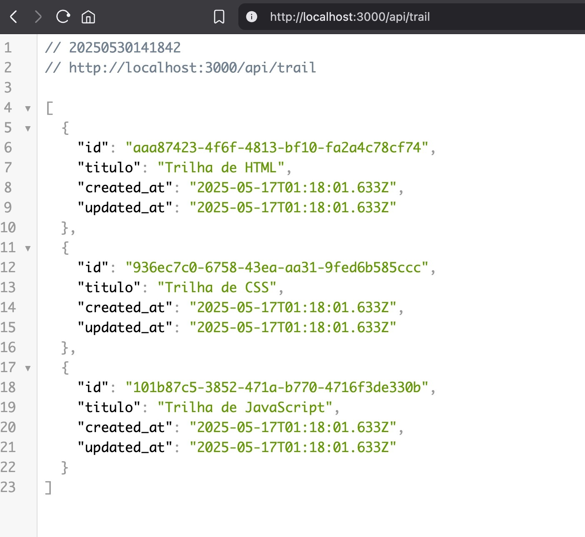
  Fonte: Material produzido pelos autores (2025) 

&emsp; Além disso, foi iniciado o desenvolvimento do front-end da aplicação com uma abordagem rudimentar, utilizando exclusivamente HTML, Tailwind CSS e JavaScript. Essa interface ainda está em estágio inicial, mas já apresenta a estrutura necessária para integrar as funcionalidades do sistema à experiência do usuário. Segue um exemplo da tela inicial e da tela de trilhas:

 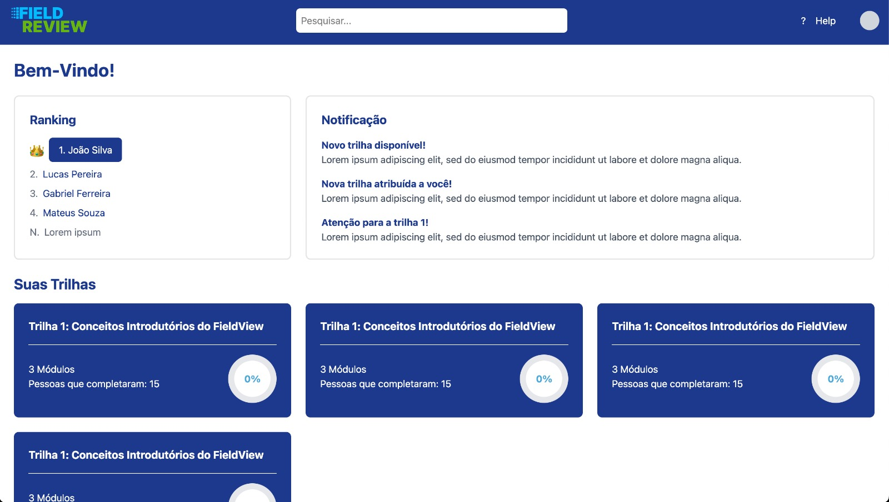
  Fonte: Material produzido pelos autores (2025) 

 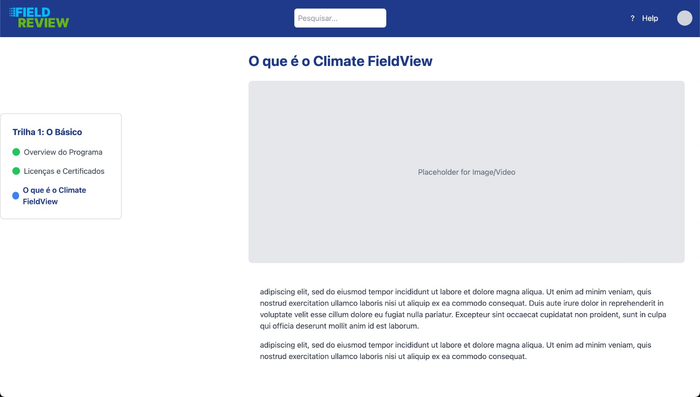
  Fonte: Material produzido pelos autores (2025) 

&emsp;Uma das dificuldades encontradas foi agrupar adequadamente cada entidade dos models no seu domínio do controller apropriado, por haver diversas tabelas de relacionamento, foi necessário tirar dúvidas com os professores e monitores sobre a melhor forma de organizar a estrutura do projeto.

&emsp; Apesar de a conexão com banco de dados ainda não estar confirmada para esta entrega, a arquitetura do projeto já se encontra preparada para sua integração futura. O código está organizado de forma a facilitar essa conexão, assim como eventuais implementações de autenticação, validação e persistência de dados.

&emsp; A evolução desta versão envolverá a validação da comunicação entre front-end e back-end, a consolidação da integração com o banco de dados e a melhoria progressiva da interface de usuário, tornando-a mais interativa e visualmente consistente com a identidade do projeto.

## 4.2. Segunda versão da aplicação web (sprint 4)

*Descreva e ilustre aqui o desenvolvimento da sua segunda versão do sistema web, explicando brevemente o que foi entregue em termos de código e sistema. Utilize prints de tela para ilustrar. Indique as eventuais dificuldades e próximos passos.*

## 4.3. Versão final da aplicação web (sprint 5)

*Descreva e ilustre aqui o desenvolvimento da última versão do sistema web, explicando brevemente o que foi entregue em termos de código e sistema. Utilize prints de tela para ilustrar. Indique as eventuais dificuldades e próximos passos.*

# 5. Testes

## 5.1. Relatório de testes de integração de endpoints automatizados (sprint 4)

*Liste e descreva os testes unitários dos endpoints criados, automatizados e planejados para sua solução. Posicione aqui também o relatório de cobertura de testes Jest se houver (através de link ou transcrito para estrutura markdown)*

## 5.2. Testes de usabilidade (sprint 5)

*Posicione aqui as tabelas com enunciados de tarefas, etapas e resultados de testes de usabilidade. Ou utilize um link para seu relatório de testes (mantenha o link sempre público para visualização)*

# 6. Estudo de Mercado e Plano de Marketing (sprint 4)

## 6.1 Resumo Executivo

*Preencher com até 300 palavras, sem necessidade de fonte*

*Apresente de forma clara e objetiva os principais destaques do projeto: oportunidades de mercado, diferenciais competitivos da aplicação web e os objetivos estratégicos pretendidos.*

## 6.2 Análise de Mercado

*a) Visão Geral do Setor (até 250 palavras)*
*Contextualize o setor no qual a aplicação está inserida, considerando aspectos econômicos, tecnológicos e regulatórios. Utilize fontes confiáveis.*

*b) Tamanho e Crescimento do Mercado (até 250 palavras)*
*Apresente dados quantitativos sobre o tamanho atual e projeções de crescimento do mercado. Utilize fontes confiáveis.*

*c) Tendências de Mercado (até 300 palavras)*
*Identifique e analise tendências relevantes (tecnológicas, comportamentais e mercadológicas) que influenciam o setor. Utilize fontes confiáveis.*

## 6.3 Análise da Concorrência

*a) Principais Concorrentes (até 250 palavras)*
*Liste os concorrentes diretos e indiretos, destacando suas principais características e posicionamento no mercado.*

*b) Vantagens Competitivas da Aplicação Web (até 250 palavras)*
*Descreva os diferenciais da sua aplicação em relação aos concorrentes, sem necessidade de citação de fontes.*

## 6.4 Público-Alvo

*a) Segmentação de Mercado (até 250 palavras)*
Descreva os principais segmentos de mercado a serem atendidos pela aplicação. Utilize bases de dados e fontes confiáveis.*

*b) Perfil do Público-Alvo (até 250 palavras)*
*Caracterize o público-alvo com dados demográficos, psicográficos e comportamentais, incluindo necessidades específicas. Utilize fontes obrigatórias.*

## 6.5 Posicionamento

*a) Proposta de Valor Única (até 250 palavras)*
*Defina de maneira clara o que torna a sua aplicação única e valiosa para o mercado.*

*b) Estratégia de Diferenciação (até 250 palavras)*
*Explique como sua aplicação se destacará da concorrência, evidenciando a lógica por trás do posicionamento.*

## 6.6 Estratégia de Marketing 

*a) Produto/Serviço (até 200 palavras)*
*Descreva as funcionalidades, benefícios e diferenciais da aplicação*

*6.2 Preço (até 200 palavras)*
*Explique o modelo de precificação adotado e justifique com base nas análises anteriores.*

*6.3 Praça (Distribuição)*

&emsp; O FieldReview, como aplicação web, é distribuído via navegadores, acessível em dispositivos Android, iOS (iPads, iPhones) e desktops, semelhante ao Climate FieldView™. A Bayer o disponibiliza em seu site oficial (cropscience.bayer.com) e na plataforma Orbia, conectando Promotores Técnicos Digitais (PTDs) a agricultores. O LinkedIn é utilizado para promover a ferramenta, com posts direcionados aos profissionais do agronegócio, destacando benefícios como monitoramento de lavouras. Usando sistemas de CRM, a Bayer envia e-mails segmentados a PTDs, com links diretos para o FieldReview e guias de uso, facilitando a adoção. Eventos como a Agrishow e dias de campo do Bayer Forward Farming promovem a ferramenta com demonstrações práticas e QR codes para acesso via navegador. A integração com o programa Impulso Bayer reforça a distribuição, oferecendo benefícios como pontos para usuários, garantindo alcance e engajamento com agricultores e distribuidores.

*6.4 Promoção (até 200 palavras)*
*Descreva as estratégias digitais planejadas, como SEO, redes sociais, marketing de conteúdo e campanhas pagas.*

# 7. Conclusões e trabalhos futuros (sprint 5)

*Escreva de que formas a solução da aplicação web atingiu os objetivos descritos na seção 2 deste documento. Indique pontos fortes e pontos a melhorar de maneira geral.*

*Relacione os pontos de melhorias evidenciados nos testes com planos de ações para serem implementadas. O grupo não precisa implementá-las, pode deixar registrado aqui o plano para ações futuras*

*Relacione também quaisquer outras ideias que o grupo tenha para melhorias futuras*

# 8. Referências (sprints 1 a 5)

1. AGROLINK. Perfil dos produtores rurais no Brasil: mais jovens e conectados. 2023. Disponível em: https://www.agrolink.com.br/noticias/perfil-dos-produtores-rurais-no-brasil--mais-jovens-e-conectados_483737.html. Acesso em: 29 abr. 2025.

2. AGROPAGES. Top 20 global agrochemical companies in 2023 unveiled. 2024. Disponível em: https://news.agropages.com/News/NewsDetail---51737.htm. Acesso em: 29 abr. 2025.

3. BAYER. Agro Bayer Brasil. 2025. Disponível em: https://www.agro.bayer.com.br/. Acesso em: 29 abr. 2025

4. BAYER CROP SCIENCE. Climate FieldView™. São Paulo: Bayer, [2024]. Disponível em: https://www.agro.bayer.com.br/climate-fieldview. Acesso em: 29 abr. 2025.

5. BAYER CROP SCIENCE. Impulso Bayer: o programa. São Paulo: Bayer, [2024]. Disponível em: https://www.agro.bayer.com.br/impulso-bayer/o-programa. Acesso em: 29 abr. 2025.

6. COODESH. O que é arquitetura MVC? Coodesh, 2025. Disponível em: https://coodesh.com/blog/dicionario/o-que-e-arquitetura-mvc/. Acesso em: 30 maio 2025.

7. HARSH, Kumar. O que é Arquitetura de Aplicativos Web? Quebrando um aplicativo da Web. Kinsta, 17 jan. 2025. Disponível em: https://kinsta.com/pt/blog/arquitetura-aplicativos-web/. Acesso em: 30 maio 2025.

8. INTELIGÊNCIA FINANCEIRA. Empresas do agronegócio: as maiores companhias agrícolas do mundo. 2024. Disponível em: https://inteligenciafinanceira.com.br/onde-investir/investir-em-agronegocios/empresas-do-agronegocio-as-maiores-companhias-agricolas-do-mundo/. Acesso em: 29 abr. 2025.

9. MAGRETTA, Joan. Entendendo Michael Porter: o guia essencial da competição e estratégia [recurso eletrônico]. 1. ed. Rio de Janeiro: Alta Books, 2019. Disponível em: https://integrada.minhabiblioteca.com.br. Acesso em: 29 abr. 2025.

10. MARKET RESEARCH FUTURE. Digital agriculture market research report—global forecast 2030. 2023. Disponível em: https://www.marketresearchfuture.com/reports/digital-Agricultureiculture-market-10695. Acesso em: 29 abr. 2025.

11. MARKET RESEARCH FUTURE. Seeds market research report. [S.l.]: Market Research Future, 2023. Disponível em: https://www.marketresearchfuture.com/reports/seeds-market-7252. Acesso em: 28 abr. 2025.

12. PEREIRA, Daniel. O que é o Value Proposition Canvas?. [S. l.], 27 set. 2024. Disponível em: https://businessmodelanalyst.com/pt/value-proposition-canvas/. Acesso em: 27 mar. 2025.

# Anexos

*Inclua aqui quaisquer complementos para seu projeto, como diagramas, imagens, tabelas etc. Organize em sub-tópicos utilizando headings menores (use ## ou ### para isso)*
